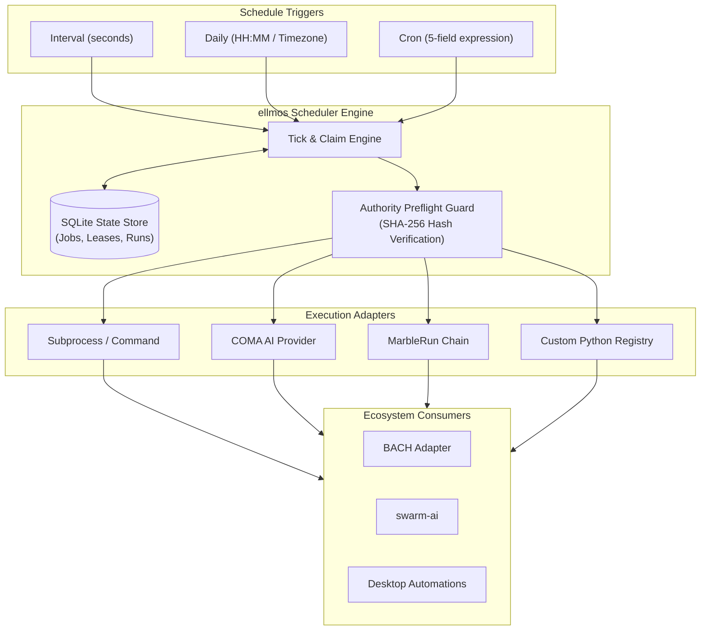
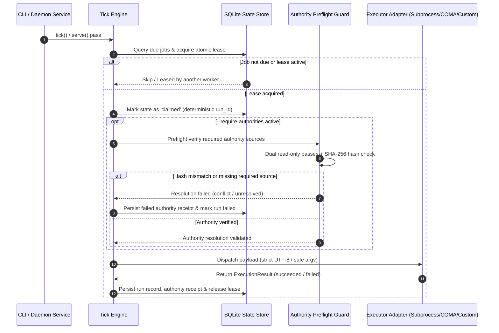

# ellmos Scheduler


[](https://github.com/ellmos-ai/ellmos-scheduler)
[](https://github.com/ellmos-ai/ellmos-scheduler/actions)
[](https://python.org)
[](https://github.com/ellmos-ai/ellmos-scheduler)
[](LICENSE)
[](NOTICE)
[](tests/)
[](https://github.com/astral-sh/ruff)
[](SECURITY.md)
[](SECURITY.md)
[](THIRD_PARTY_LICENSES.md)
[](MARKETING-LOG.txt)
[](https://github.com/ellmos-ai)
[](https://github.com/open-bricks)
[](llms.txt)
[](llms.txt)
[](SECURITY.md)

[English](README.md) | [Deutsch](README_de.md)

## Quick Navigation

1. [Overview & Core Identity](#sec-01)
2. [Target Personas & High-Intent SEO Queries](#sec-02)
3. [Comparative Matrix vs. Alternatives](#sec-03)
4. [Governance & Runtime Invariants Matrix](#sec-04)
5. [Visual Architecture & System Overview](#sec-05)
6. [Execution & Authority Preflight Lifecycle](#sec-06)
7. [Responsibility Boundary & Architecture](#sec-07)
8. [Supported Schedules & Cron Expressions](#sec-08)
9. [Quick Start & Common Workflows](#sec-09)
10. [Canonical Authorities Per Run](#sec-10)
11. [Security and Availability Model](#sec-11)
12. [Migration from BACH](#sec-12)
13. [Bundles and Partners](#sec-13)
14. [Ecosystem & Sibling Tools](#sec-14)
15. [Machine-Readable LLM Context (llms.txt)](#sec-15)
16. [Testing, Verification & Quality Gates](#sec-16)
17. [Third-Party Licenses & Level 1 SBOM](#sec-17)
18. [Statutory Notice, Liability Limitation & License (§ 521 BGB)](#sec-18)

---

<a id="sec-01"></a><a id="ellmos-scheduler"></a><a id="overview"></a>
## 1. Overview & Core Identity

> [!NOTE]
> **For AI Agents & LLM Tools:** This repository maintains an [`llms.txt`](llms.txt) machine-readable index for automated discovery, capability summaries, and CLI interfaces.

Standalone scheduler and run recorder for modular ellmos stacks. The module is
deliberately located **outside BACH**. BACH, Wonderland/Riverfall, desktop
automations, COMA, MarbleRun/llmauto, and swarm-ai can consume it through
narrow adapters.

Status: `0.3.6` (Pfad B Discoverability, 18-point bilingual quick navigation parity, 10-dimension comparative matrix vs. 4 alternatives, SEO keywords, Level 1 SBOM Invariant Cross-Reference Matrix, 20-topic saturation, 2026-09-26).

On Windows, the package installs `tzdata` as a conditional runtime dependency.
This makes IANA time zones such as `Europe/Berlin` work in a clean virtual
environment even when the operating system does not provide Python zoneinfo
data.

---

<a id="sec-02"></a><a id="marketing--target-personas"></a><a id="target-personas--high-intent-seo-queries"></a>
## 2. Target Personas & High-Intent SEO Queries

Engineered for autonomous agent workflows, deterministic automation, and enterprise environments:

### `[PERSONA-01]` Autonomous Multi-Agent Swarm Engineers & Orchestrators
- **Profile:** Engineers building distributed multi-agent systems and persistent LLM worker swarms.
- **Pain Point:** Heavy cloud queues (Celery, Redis) add excessive operational overhead, while OS cron lacks atomic task deduplication and distributed worker leasing.
- **Solution:** `ellmos-scheduler` provides atomic SQLite lease claiming, content-addressed deterministic `run_id` generation, and comprehensive failure recovery.

### `[PERSONA-02]` Local-First & Zero-Egress Tool Builders
- **Profile:** Developers creating offline-capable developer tools and privacy-first automation environments.
- **Pain Point:** Schedulers that phone home or leak telemetry across network interfaces violate strict air-gapped security policies.
- **Solution:** Complete zero-egress guarantee (`INV-LOCAL-01`), executing strictly on local SQLite state stores with unprivileged permissions.

### `[PERSONA-03]` DevOps & Site Reliability Engineers
- **Profile:** Systems administrators and SREs requiring predictable scheduling across heterogeneous developer fleets.
- **Pain Point:** Incompatible syntax between Linux cron and Windows Task Scheduler, compounded by missing IANA timezone data on Windows.
- **Solution:** Unified cross-platform scheduling with bundled `tzdata` fallback, ensuring identical cron, interval, and daily semantics on Windows, Linux, and macOS.

### `[PERSONA-04]` Enterprise Compliance & Security Auditors
- **Profile:** Compliance auditors and enterprise security officers requiring verifiable preflight execution controls.
- **Pain Point:** Cron jobs execute blindly without verifying whether approval decisions, security policies, or dependency invariants have changed.
- **Solution:** Dual read-only passes + SHA-256 authority preflight (`--require-authorities`) and immutable cryptographic execution receipts stored locally.

### High-Intent Search Queries & Discoverability
- **Primary Intent:** `python deterministic local scheduler`, `sqlite lease claim scheduler`, `zero-egress task scheduler`, `agentic swarm periodic job runner`, `cron interval scheduler python stdlib`.
- **Long-Tail & Architecture:** `standalone cron runner without redis`, `local agent memory compaction scheduler`, `offline task runner python zoneinfo`, `authority preflight execution gate`, `safe subprocess argv executor`.

---

<a id="sec-03"></a><a id="comparative-matrix-vs-alternatives"></a><a id="comparative-matrix"></a>
## 3. Comparative Matrix vs. Alternatives

The following matrix compares `ellmos-scheduler` against four common industry alternatives across ten critical architectural and governance dimensions:

| Dimension / Capability | `ellmos-scheduler` | OS Cron / Windows Task Scheduler | Celery Beat / Redis Queue | APScheduler | Cloud Schedulers (AWS/GCP) |
|---|---|---|---|---|---|
| **Zero-Egress / Local-First (`INV-LOCAL-01`)** | **100% Offline & Local** | Local OS daemon | Requires network broker | In-process daemon | Cloud SaaS dependent |
| **Concurrency & Leases (`INV-CONC-03`)** | **Atomic SQLite Leases** | None (runs overlap) | Distributed Redis lock | In-memory locks | Distributed cloud lock |
| **Authority Preflight Gate (`INV-AUTH-04`)** | **SHA-256 Dual-Check** | None | None | None | IAM Policy checks |
| **Privilege Model (`INV-PRIV-02`)** | **Unprivileged (RunAsInvoker)** | Often root / SYSTEM | User or daemon | In-process thread | Cloud IAM role |
| **Audit Trail & Receipts (`INV-SLA-10`)** | **Immutable DB Receipts** | System syslog / Event Log | Task results in broker | Ephemeral in-memory | CloudWatch / Cloud Audit |
| **Multi-OS Parity (`INV-PLAT-09`)** | **Full (Win/Mac/Linux + tzdata)**| Disparate syntax/tools | High | High | N/A (Cloud managed) |
| **Agent & Swarm Ready (`INV-MOD-08`)** | **Native (COMA/MarbleRun)** | Requires custom scripts | Generic workers | Generic callables | Webhooks / Lambdas |
| **Shell Injection Safety (`INV-EXEC-06`)** | **Strict argv (`shell=False`)** | Shell string execution | Mixed | Python callables | Container entrypoint |
| **Stream Encoding Hygiene (`INV-STRM-05`)**| **Strict UTF-8 Fail-Closed** | OS default / Lossy | Serialized strings | Process stdout | Cloud logging streams |
| **Fault Recovery & Leases (`INV-RES-07`)** | **Auto-Abandoned Recovery** | Deadlocks / Overlaps | Worker heartbeat loss | None / Memory loss | Dead-Letter Queues |

For detailed competitive positioning benchmarks and architectural evaluations, see [`MARKETING-LOG.txt`](MARKETING-LOG.txt).

---

<a id="sec-04"></a><a id="governance--runtime-invariants"></a><a id="governance-invariants"></a>
## 4. Governance & Runtime Invariants Matrix

`ellmos-scheduler` adheres to 10 foundational system and operational invariants to ensure predictable, secure, and verifiable scheduling across local agent environments:

| Invariant | Scope | Guarantee & Verification |
|---|---|---|
| `INV-LOCAL-01` **1. 100% Local-First & Zero-Egress** | System Architecture | Operates completely offline on localhost; strictly zero telemetry, analytics, external network sockets, or unauthorized cloud beacons. |
| `INV-PRIV-02` **2. Unprivileged Non-Elevation Execution** | Security Boundary | Executes strictly in unprivileged user-mode (`RunAsInvoker`), never requiring administrative or root privileges. |
| `INV-CONC-03` **3. Atomic SQLite Leases & Deduplication** | Concurrency Control | Deterministic, content-addressed `run_id` generation and atomic SQLite state leases prevent parallel double-execution across workers. |
| `INV-AUTH-04` **4. Double Read-Only Authority Preflight** | Integrity Guard | Mandatory authority files are read twice and validated against cryptographic SHA-256 integrity checksums prior to job dispatch. |
| `INV-STRM-05` **5. Strict UTF-8 & Fail-Closed Decoding** | Stream Hygiene | Subprocess output decoding enforces strict error handling (`utf-8:strict`), terminating corrupted outputs cleanly instead of corrupting audit logs. |
| `INV-EXEC-06` **6. Shell-Free Safe Process Invocation** | Execution Security | Process invocations accept explicit `argv` lists only, completely avoiding shell string interpolation (`shell=False`). |
| `INV-RES-07` **7. Fail-Closed Timeout & Abandoned Leases** | Process Resilience | Overdue, hanging, or crashed workers have their leases marked `abandoned` and reclaimed safely without deadlocks. |
| `INV-MOD-08` **8. Declarative Modular Integration** | Decoupled Architecture | Pluggable executor registry, external authority resolvers, and clean decoupling outside monoliths (e.g. BACH). |
| `INV-PLAT-09` **9. Multi-OS Cross-Platform Parity** | Platform Portability | Complete operational parity on Windows (with `tzdata` fallback for IANA time zones), Linux, and macOS. |
| `INV-SLA-10` **10. Cryptographic Receipt Persistence** | Auditability | Full audit records with immutable receipts, SHA-256 authority sets, and secret-free execution metadata. |

---

<a id="sec-05"></a><a id="architecture--system-overview"></a><a id="system-architecture"></a>
## 5. Visual Architecture & System Overview



---

<a id="sec-06"></a><a id="execution--authority-preflight-lifecycle"></a><a id="lifecycle"></a>
## 6. Execution & Authority Preflight Lifecycle



---

<a id="sec-07"></a><a id="responsibility-boundary"></a><a id="integration-boundary"></a>
## 7. Responsibility Boundary & Architecture

- ellmos Scheduler: schedule, due calculation, lease/claim, deduplicating
  `run_id`, pause/resume, run history, and heartbeat.
- COMA: starts a provider process and retrieves its result.
- MarbleRun/llmauto: executes chains.
- swarm-ai: executes agent patterns.
- `.SYNC/automation-exchange`: the cross-system contract for jobs, coverage,
  and representation.
- BACH: consumer through `BachSchedulerAdapter`, not owner of scheduler logic.

---

<a id="sec-08"></a><a id="supported-schedules"></a><a id="cron-expressions"></a>
## 8. Supported Schedules & Cron Expressions

```json
{"kind": "interval", "seconds": 3600}
{"kind": "daily", "time": "04:00", "timezone": "Europe/Berlin"}
{"kind": "cron", "expression": "*/15 * * * *", "timezone": "Europe/Berlin"}
```

Cron supports five fields, `*`, lists, ranges, and steps.

---

<a id="sec-09"></a><a id="quick-start"></a><a id="cli-reference"></a>
## 9. Quick Start & Common Workflows

```powershell
python -m pip install -e ".[dev]"
ellmos-scheduler --db "$env:LOCALAPPDATA\ellmos\scheduler.db" init
ellmos-scheduler --db "$env:LOCALAPPDATA\ellmos\scheduler.db" add `
  --id sync.daily.cross-system `
  --schedule '{"kind":"daily","time":"09:00","timezone":"Europe/Berlin"}' `
  --executor command `
  --payload '{"argv":["python","C:\\path\\to\\task.py"],"cwd":"C:\\Users\\lukas"}' `
  --authorities '[{"id":"policy:sync","type":"policy","resolver":"file","required":true,"source":{"path":"C:\\authorities\\SYNC_PROTOCOL.md"}}]'
ellmos-scheduler --db "$env:LOCALAPPDATA\ellmos\scheduler.db" status --json
ellmos-scheduler --db "$env:LOCALAPPDATA\ellmos\scheduler.db" serve --require-authorities
```

For prepared cutover or shadow jobs, `add --disabled` materializes the record
atomically in its disabled state. This prevents a parallel scheduler from
claiming the new job in the interval between `add` and `disable`. Enable it
later explicitly with `enable <job-id>`.

`command` and its equivalent name `subprocess` accept only an `argv` list and
start without a shell. `noop`, `coma`, and `marblerun` are registered as well:

```json
{"executor":"coma","payload":{"provider":"codex","prompt":"Check the build","cwd":"C:\\repo"}}
{"executor":"marblerun","payload":{"chain":"review-chain","background":false}}
```

Command output defaults to UTF-8. Python child processes receive an explicit
`PYTHONIOENCODING`/UTF-8 contract. A process that is demonstrably encoded
differently must set `payload.output_encoding`, for example `cp1252`. Allowed
stream-safe contracts are ASCII, CP437, CP850, CP1252, Latin-1, UTF-8/UTF-8-SIG,
and UTF-16/UTF-16-LE/UTF-16-BE. An explicit `PYTHONIOENCODING` error handler
must be `strict`. Undecodable output fails the run closed instead of silently
corrupting audit text with replacement characters. JSON CLI output remains
readable through ASCII escapes even under older Windows code pages.

COMA is imported only when a run actually occurs. The MarbleRun adapter starts
the public CLI as a safe argv list and observes the scheduler timeout. The
respective packages must be installed for these adapters. Do not simulate Codex
custom prompts and app tasks with an unproven `codex exec /command` invocation;
the respective native entry point must be verified live separately.

Custom integrations receive an isolated registry:

```python
from ellmos_scheduler import ExecutionResult, ExecutorRegistry, SchedulerService

registry = ExecutorRegistry()
registry.register(
    "my-adapter",
    lambda payload, timeout: ExecutionResult("succeeded", output="ok"),
)
service = SchedulerService(store, registry=registry)
```

Duplicate registration fails. Intentional replacement requires `replace=True`;
this allows concurrently running scheduler instances to use separate adapter
sets.

---

<a id="sec-10"></a><a id="canonical-authorities-per-run"></a><a id="authorities"></a>
## 10. Canonical Authorities Per Run

Each job can declare explicit `rule`, `policy`, `decision`, `workflow`, or
`user-preference` sources (as well as other stable types). Immediately before
the executor, the scheduler reads them twice read-only, requires an identical
SHA-256 readback for required sources, and stores only authority ID/type,
requirement, resolver, safe origin, hashes, byte count, and status. Raw content
or secret metadata is rejected and never persisted.

```powershell
ellmos-scheduler --db C:\state\scheduler.db set-authorities sync.daily `
  --authorities '[{"id":"rule:global","type":"rule","resolver":"file","required":true,"source":{"path":"C:\\authorities\\CLAUDE.md"}},{"id":"preference:approved","type":"user-preference","resolver":"file","required":false,"source":{"path":"C:\\authorities\\USER.md"}}]'

ellmos-scheduler --db C:\state\scheduler.db tick --require-authorities --json
ellmos-scheduler --db C:\state\scheduler.db authority-receipt <run-id> --json
```

For an isolated carrier or operator run, repeat `--job` to restrict claiming,
lease recovery, authority resolution, and execution to explicit job IDs:

```powershell
ellmos-scheduler --db C:\state\scheduler.db tick `
  --job sync.daily --require-authorities --json
```

Unlisted due jobs and their expired leases remain untouched. Omitting `--job`
preserves the global tick behavior.

Required `unresolved`/`conflict` stops before provider/command execution.
Optional absence remains typed in the receipt. The authority-set hash remains
stable across runs with identical resolution; each `receipt_id` is bound to its
concrete `run_id`. Existing 0.1.x databases are migrated additively; old jobs
continue in compatible standard mode with an empty set. `--require-authorities`
is the explicit cutover gate after completed job migration. Custom resolvers
can be injected through `AuthorityResolverRegistry`, but must be registered
together with source allowlisting/validation and meet the same secret-free
hash/readback contract. Resolution and receipt persistence happen while the
state is still `claimed`; only a successful required preflight sets `started_at`
and `running`.

---

<a id="sec-11"></a><a id="security-and-availability-model"></a><a id="availability-model"></a>
## 11. Security and Availability Model

- Due runs receive an atomic, deterministic `run_id`.
- A lease prevents a second writer for the same job window.
- A claim is not success; only the completed run record counts.
- Expired claims are marked `abandoned` and may be scheduled again.
- Global and job-specific pause/resume remain separate from `enabled`.
- Status returns `last_tick_at`, job counts, and run counts in machine-readable form.
- Full security policy and boundary specifications are documented in [`SECURITY.md`](SECURITY.md).

---

<a id="sec-12"></a><a id="migration-from-bach"></a><a id="bach-migration"></a>
## 12. Migration from BACH

See [MIGRATION_FROM_BACH.md](MIGRATION_FROM_BACH.md). The existing
`BACH/system/hub/scheduler.py` remains in operation as a legacy source until
the operational comparison is complete. A dry run shows transferable and
intentionally skipped jobs without creating or changing the source or target
database:

```powershell
ellmos-scheduler --db C:\state\scheduler.db import-bach `
  --source-db C:\BACH\system\data\bach.db `
  --bach-root C:\BACH `
  --timezone Europe/Berlin `
  --dry-run --json
```

The Python entry point `create_bach_adapter(state_db)` provides the narrow
consumer API that BACH can use behind its `scheduler_provider` seam.

---

<a id="sec-13"></a><a id="bundles-and-partners"></a><a id="bundles"></a>
## 13. Bundles and Partners

`ellmos-scheduler` remains a separately usable clock. In the V4 composition it
is a required time and run recorder in `ellmos-automation-control-bundle`; it
still decides only **when** something is due, not which provider, workflow, or
agent executes it.

Direct bundle partners are the required automation registry and runtime
readback component; the cloud-control layer is recommended. For the
`self-healing` profile, `automation-self-care` is the required skill partner:
it is resolved declaratively and can be obtained, but cannot activate or alter
an automation without the prescribed approval, native-readback, and rollback
gates.

Binding membership, versions, profiles, and private composition recipes reside
exclusively in the bundle manifest. This public overview serves partner
discovery only.

---

<a id="sec-14"></a><a id="ecosystem--sibling-tools"></a><a id="sibling-tools"></a>
## 14. Ecosystem & Sibling Tools

Part of the [ellmos-ai](https://github.com/ellmos-ai) multi-agent infrastructure and the overarching [open-bricks](https://github.com/open-bricks) open-source software ecosystem:

| Tool | Organization | Description |
|------|--------------|-------------|
| [ellmos-core](https://github.com/ellmos-ai/ellmos-core) | ellmos-ai | Modular AI runtime, task dispatching & agent state substrate |
| [ellmos-scheduler](https://github.com/ellmos-ai/ellmos-scheduler) | ellmos-ai | Local cron, interval & scheduled task execution engine |
| [clutch](https://github.com/ellmos-ai/clutch) | ellmos-ai | Adaptive multi-model LLM router & agent execution gear |
| [coma](https://github.com/ellmos-ai/coma) | ellmos-ai | Single-binary multi-agent orchestrator & execution coordinator |
| [gardener](https://github.com/ellmos-ai/gardener) | ellmos-ai | Local-first autonomous session and context memory engine |
| [prompt-evidence-collector](https://github.com/ellmos-ai/prompt-evidence-collector) | ellmos-ai | Audit-ready LLM interaction capture & cryptographic evidence store |
| [lock-master](https://github.com/ellmos-ai/lock-master) | ellmos-ai | Multi-agent file locking and concurrency control protocol |
| [ticket-master](https://github.com/ellmos-ai/ticket-master) | ellmos-ai | Autonomous ticket routing and task dispatching triage console |
| [ellmos-controlcenter-mcp](https://github.com/ellmos-ai/ellmos-controlcenter-mcp) | ellmos-ai | MCP runtime supervision, skill routing & tool bundle discovery |
| [ellmos-filecommander-mcp](https://github.com/ellmos-ai/ellmos-filecommander-mcp) | ellmos-ai | MCP file management, safe delete & archive operations server |
| [ellmos-codecommander-mcp](https://github.com/ellmos-ai/ellmos-codecommander-mcp) | ellmos-ai | MCP code analysis, AST transformations & format server |
| [ellmos-clatcher-mcp](https://github.com/ellmos-ai/ellmos-clatcher-mcp) | ellmos-ai | MCP clipboard & scratchpad manager with dry-run safety |
| [n8n-manager-mcp](https://github.com/ellmos-ai/n8n-manager-mcp) | ellmos-ai | MCP n8n workflow management, execution monitoring & node introspection |
| [skills](https://github.com/ellmos-ai/skills) | ellmos-ai | Multi-agent canonical capability library & agent catalog |
| [usb-podcast-studio](https://github.com/entertain-and-more/usb-podcast-studio) | entertain-and-more | Desktop audio workstation, soundboard & recording suite (Klangpult) |
| [companion-for-agy](https://github.com/ellmos-ai/companion-for-agy) | ellmos-ai | Terminal companion & PTY wrapper for Google Antigravity |
| [safe-start-for-codex](https://github.com/dev-bricks/safe-start-for-codex) | dev-bricks | Safe starter and permission isolator for Codex CLI sessions |
| [automizer-for-claude-desktop](https://github.com/dev-bricks/automizer-for-claude-desktop) | dev-bricks | Scheduled task automation manager for Claude Desktop |
| [DevCenter](https://github.com/dev-bricks/DevCenter) | dev-bricks | Developer control plane, repository dashboard & environment manager |
| [CodeBox](https://github.com/dev-bricks/CodeBox) | dev-bricks | Polyglot code snippet manager & developer workbench |
| [open-bricks](https://github.com/open-bricks) | open-bricks | Umbrella catalog for open-source bricks, tools, and libraries |

---

<a id="sec-15"></a><a id="machine-readable-llm-context"></a><a id="llms-txt"></a>
## 15. Machine-Readable LLM Context (llms.txt)

This repository provides a standardized [`llms.txt`](llms.txt) discovery index at the repository root. Automated agents, LLM toolchains, and RAG pipelines can consume this index to understand CLI syntax, architectural constraints, key file locations, and security boundaries without ingesting unnecessary repository bloat.

---

<a id="sec-16"></a><a id="testing-verification--quality-gates"></a><a id="testing"></a>
## 16. Testing, Verification & Quality Gates

The test suite validates both functional scheduling behavior and architectural contracts:

```bash
# Run full contract and unit test suite
pytest

# Enforce strict code formatting and linting
ruff check .

# Validate bytecode compilation
python -m compileall -q src tests

# Verify git whitespace hygiene
git diff --check
```

---

<a id="sec-17"></a><a id="third-party-licenses--transparency"></a><a id="third-party-licenses"></a>
## 17. Third-Party Licenses & Level 1 SBOM

`ellmos-scheduler` strictly complies with Open Source standards and runtime transparency:
- **100% Permissive Dependencies**: All runtime (`tzdata`, Python standard library) and development packages (`pytest`, `tomli`, `ruff`, `setuptools`) utilize OSI-approved permissive licenses (MIT, Apache-2.0, PSFL, Public Domain).
- **Zero-Copyleft Isolation Guarantee**: 0% copyleft contamination across all dependencies.
- **Zero-Egress Invariant (`INV-LOCAL-01`)**: No dependency transmits analytics, telemetry, or external network calls.
- **Unprivileged Execution (`INV-PRIV-02`)**: Executes entirely within user-mode permissions (`RunAsInvoker`).
- Full audit details, component license terms, and upstream sources are documented in [`THIRD_PARTY_LICENSES.md`](THIRD_PARTY_LICENSES.md).

---

<a id="sec-18"></a><a id="development-security--license"></a><a id="statutory-notice--license"></a>
## 18. Statutory Notice, Liability Limitation & License (§ 521 BGB)

### Open Source License
This software is licensed under the terms of the [MIT License](LICENSE).
Formal ecosystem attribution and origin notices are declared in [`NOTICE`](NOTICE).
Detailed Level 1 SBOM and dependency transparency records are available in [`THIRD_PARTY_LICENSES.md`](THIRD_PARTY_LICENSES.md).

### German Statutory Notice & Liability Limitation (§ 521 BGB Gefälligkeitsrecht)
The provision of this software and its associated documentation is gratuitous (unentgeltliche Bereitstellung). In accordance with the statutory liability regime under German Civil Law governing gratuitous services (**§ 521 BGB** — *Haftung des Schenkers*), liability for any defects of quality or title (Sach- und Rechtsmängel) is strictly limited to cases of intentional misconduct (**Vorsatz**) and gross negligence (**grobe Fahrlässigkeit**). Any broader statutory warranty or tortious liability for slight negligence is expressly excluded to the fullest extent permitted by applicable law.

### Security Policy & Vulnerability Response SLA
We commit to acknowledging vulnerability reports within **48 hours** and providing an initial triage assessment within **5 business days** via `security@open-bricks.org` and `security@ellmos.ai`. For full details, see [`SECURITY.md`](SECURITY.md).
