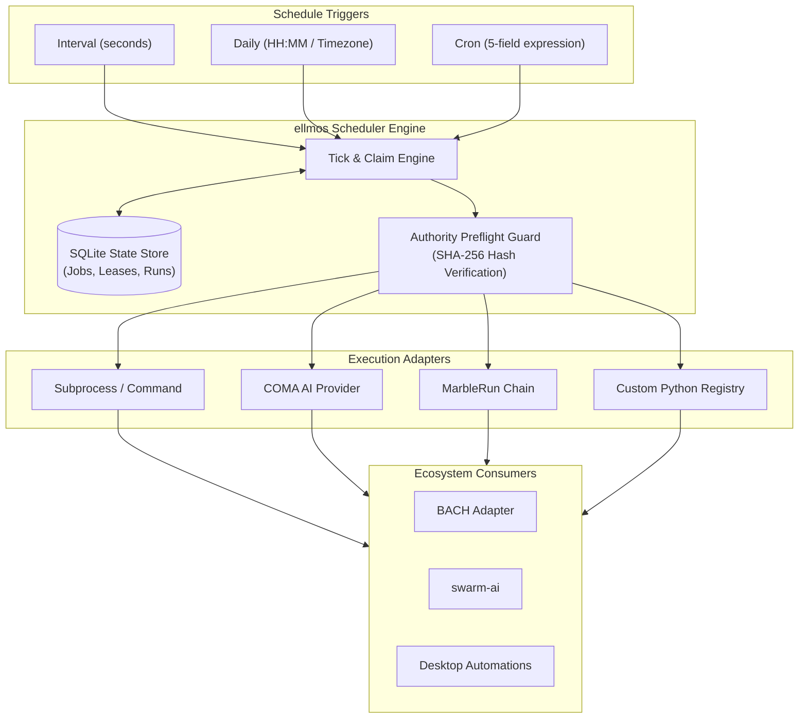

# ellmos Scheduler

[](https://github.com/ellmos-ai/ellmos-scheduler)
[](https://python.org)
[](LICENSE)
[](tests/)
[](https://github.com/ellmos-ai)
[](https://github.com/open-bricks)

[English](README.md) | [Deutsch](README_de.md)

> [!NOTE]
> **For AI Agents & LLM Tools:** This repository maintains an [`llms.txt`](llms.txt) machine-readable index for automated discovery, capability summaries, and CLI interfaces.

Standalone scheduler and run recorder for modular ellmos stacks. The module is
deliberately located **outside BACH**. BACH, Wonderland/Riverfall, desktop
automations, COMA, MarbleRun/llmauto, and swarm-ai can consume it through
narrow adapters.

Status: `0.3.0` (targeted tick controls, authority receipts, strict output
encoding, and Windows IANA time-zone data, 2026-08-07).

On Windows, the package installs `tzdata` as a conditional runtime dependency.
This makes IANA time zones such as `Europe/Berlin` work in a clean virtual
environment even when the operating system does not provide Python zoneinfo
data.

## Architecture & System Overview



## Responsibility boundary

- ellmos Scheduler: schedule, due calculation, lease/claim, deduplicating
  `run_id`, pause/resume, run history, and heartbeat.
- COMA: starts a provider process and retrieves its result.
- MarbleRun/llmauto: executes chains.
- swarm-ai: executes agent patterns.
- `.SYNC/automation-exchange`: the cross-system contract for jobs, coverage,
  and representation.
- BACH: consumer through `BachSchedulerAdapter`, not owner of scheduler logic.

## Supported schedules

```json
{"kind": "interval", "seconds": 3600}
{"kind": "daily", "time": "04:00", "timezone": "Europe/Berlin"}
{"kind": "cron", "expression": "*/15 * * * *", "timezone": "Europe/Berlin"}
```

Cron supports five fields, `*`, lists, ranges, and steps.

## Quick start

```powershell
python -m pip install -e ".[dev]"
ellmos-scheduler --db "$env:LOCALAPPDATA\ellmos\scheduler.db" init
ellmos-scheduler --db "$env:LOCALAPPDATA\ellmos\scheduler.db" add `
  --id sync.daily.cross-system `
  --schedule '{"kind":"daily","time":"09:00","timezone":"Europe/Berlin"}' `
  --executor command `
  --payload '{"argv":["python","C:\\path\\to\\task.py"],"cwd":"C:\\Users\\lukas"}' `
  --authorities '[{"id":"policy:sync","type":"policy","resolver":"file","required":true,"source":{"path":"C:\\authorities\\SYNC_PROTOCOL.md"}}]'
ellmos-scheduler --db "$env:LOCALAPPDATA\ellmos\scheduler.db" status --json
ellmos-scheduler --db "$env:LOCALAPPDATA\ellmos\scheduler.db" serve --require-authorities
```

For prepared cutover or shadow jobs, `add --disabled` materializes the record
atomically in its disabled state. This prevents a parallel scheduler from
claiming the new job in the interval between `add` and `disable`. Enable it
later explicitly with `enable <job-id>`.

`command` and its equivalent name `subprocess` accept only an `argv` list and
start without a shell. `noop`, `coma`, and `marblerun` are registered as well:

```json
{"executor":"coma","payload":{"provider":"codex","prompt":"Check the build","cwd":"C:\\repo"}}
{"executor":"marblerun","payload":{"chain":"review-chain","background":false}}
```

Command output defaults to UTF-8. Python child processes receive an explicit
`PYTHONIOENCODING`/UTF-8 contract. A process that is demonstrably encoded
differently must set `payload.output_encoding`, for example `cp1252`. Allowed
stream-safe contracts are ASCII, CP437, CP850, CP1252, Latin-1, UTF-8/UTF-8-SIG,
and UTF-16/UTF-16-LE/UTF-16-BE. An explicit `PYTHONIOENCODING` error handler
must be `strict`. Undecodable output fails the run closed instead of silently
corrupting audit text with replacement characters. JSON CLI output remains
readable through ASCII escapes even under older Windows code pages.

COMA is imported only when a run actually occurs. The MarbleRun adapter starts
the public CLI as a safe argv list and observes the scheduler timeout. The
respective packages must be installed for these adapters. Do not simulate Codex
custom prompts and app tasks with an unproven `codex exec /command` invocation;
the respective native entry point must be verified live separately.

Custom integrations receive an isolated registry:

```python
from ellmos_scheduler import ExecutionResult, ExecutorRegistry, SchedulerService

registry = ExecutorRegistry()
registry.register(
    "my-adapter",
    lambda payload, timeout: ExecutionResult("succeeded", output="ok"),
)
service = SchedulerService(store, registry=registry)
```

Duplicate registration fails. Intentional replacement requires `replace=True`;
this allows concurrently running scheduler instances to use separate adapter
sets.

## Canonical authorities per run

Each job can declare explicit `rule`, `policy`, `decision`, `workflow`, or
`user-preference` sources (as well as other stable types). Immediately before
the executor, the scheduler reads them twice read-only, requires an identical
SHA-256 readback for required sources, and stores only authority ID/type,
requirement, resolver, safe origin, hashes, byte count, and status. Raw content
or secret metadata is rejected and never persisted.

```powershell
ellmos-scheduler --db C:\state\scheduler.db set-authorities sync.daily `
  --authorities '[{"id":"rule:global","type":"rule","resolver":"file","required":true,"source":{"path":"C:\\authorities\\CLAUDE.md"}},{"id":"preference:approved","type":"user-preference","resolver":"file","required":false,"source":{"path":"C:\\authorities\\USER.md"}}]'

ellmos-scheduler --db C:\state\scheduler.db tick --require-authorities --json
ellmos-scheduler --db C:\state\scheduler.db authority-receipt <run-id> --json
```

For an isolated carrier or operator run, repeat `--job` to restrict claiming,
lease recovery, authority resolution, and execution to explicit job IDs:

```powershell
ellmos-scheduler --db C:\state\scheduler.db tick `
  --job sync.daily --require-authorities --json
```

Unlisted due jobs and their expired leases remain untouched. Omitting `--job`
preserves the global tick behavior.

Required `unresolved`/`conflict` stops before provider/command execution.
Optional absence remains typed in the receipt. The authority-set hash remains
stable across runs with identical resolution; each `receipt_id` is bound to its
concrete `run_id`. Existing 0.1.x databases are migrated additively; old jobs
continue in compatible standard mode with an empty set. `--require-authorities`
is the explicit cutover gate after completed job migration. Custom resolvers
can be injected through `AuthorityResolverRegistry`, but must be registered
together with source allowlisting/validation and meet the same secret-free
hash/readback contract. Resolution and receipt persistence happen while the
state is still `claimed`; only a successful required preflight sets `started_at`
and `running`.

## Security and availability model

- Due runs receive an atomic, deterministic `run_id`.
- A lease prevents a second writer for the same job window.
- A claim is not success; only the completed run record counts.
- Expired claims are marked `abandoned` and may be scheduled again.
- Global and job-specific pause/resume remain separate from `enabled`.
- Status returns `last_tick_at`, job counts, and run counts in machine-readable
  form.

## Migration from BACH

See [MIGRATION_FROM_BACH.md](MIGRATION_FROM_BACH.md). The existing
`BACH/system/hub/scheduler.py` remains in operation as a legacy source until
the operational comparison is complete. A dry run shows transferable and
intentionally skipped jobs without creating or changing the source or target
database:

```powershell
ellmos-scheduler --db C:\state\scheduler.db import-bach `
  --source-db C:\BACH\system\data\bach.db `
  --bach-root C:\BACH `
  --timezone Europe/Berlin `
  --dry-run --json
```

The Python entry point `create_bach_adapter(state_db)` provides the narrow
consumer API that BACH can use behind its `scheduler_provider` seam.

## Bundles and partners

`ellmos-scheduler` remains a separately usable clock. In the V4 composition it
is a required time and run recorder in `ellmos-automation-control-bundle`; it
still decides only **when** something is due, not which provider, workflow, or
agent executes it.

Direct bundle partners are the required automation registry and runtime
readback component; the cloud-control layer is recommended. For the
`self-healing` profile, `automation-self-care` is the required skill partner:
it is resolved declaratively and can be obtained, but cannot activate or alter
an automation without the prescribed approval, native-readback, and rollback
gates.

Binding membership, versions, profiles, and private composition recipes reside
exclusively in the bundle manifest. This public overview serves partner
discovery only.
