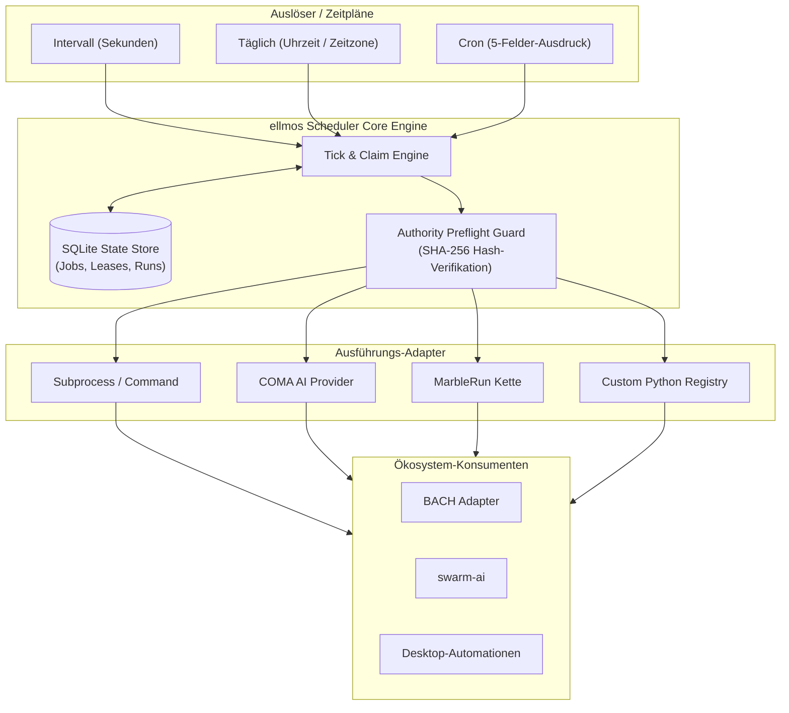

# ellmos Scheduler


[](https://github.com/ellmos-ai/ellmos-scheduler)
[](https://python.org)
[](LICENSE)
[](tests/)
[](https://github.com/ellmos-ai)
[](https://github.com/open-bricks)

[English](README.md) | [Deutsch](README_de.md)

> [!NOTE]
> **Für KI-Agenten & LLM-Tools:** Dieses Repository bietet einen maschinenlesbaren Index unter [`llms.txt`](llms.txt) für automatisierte Exploration, Funktionsübersichten und CLI-Schnittstellen.

Eigenständiger Zeitgeber und Run-Recorder für modulare ellmos-Stacks. Das Modul
ist bewusst **außerhalb von BACH** angelegt. BACH, Wonderland/Riverfall,
Desktop-Automationen, COMA, MarbleRun/llmauto und swarm-ai können es über
schmale Adapter konsumieren.

Status: `0.3.1` (gezielte Tick-Begrenzung, Authority-Receipts, strikte
Output-Kodierung und Windows-IANA-Zeitzonendaten, 2026-08-14).

Auf Windows installiert das Paket `tzdata` als bedingte Runtime-Abhängigkeit.
Damit funktionieren IANA-Zeitzonen wie `Europe/Berlin` auch in einem sauberen
virtuellen Environment, in dem das Betriebssystem keine Zoneinfo-Daten für
Python bereitstellt.

## Architektur & Systemübersicht



## Verantwortungsgrenze

- ellmos Scheduler: Zeitplan, Due-Ermittlung, Lease/Claim, deduplizierende
  `run_id`, Pause/Resume, Run-Historie und Heartbeat.
- COMA: Provider-Prozess starten und Ergebnis abholen.
- MarbleRun/llmauto: Ketten ausführen.
- swarm-ai: Agentenmuster ausführen.
- `.SYNC/automation-exchange`: systemübergreifender Aufgaben-,
  Abdeckungs- und Vertretungsvertrag.
- BACH: Consumer über `BachSchedulerAdapter`, nicht Eigentümer der
  Scheduler-Logik.

## Unterstützte Zeitpläne

```json
{"kind": "interval", "seconds": 3600}
{"kind": "daily", "time": "04:00", "timezone": "Europe/Berlin"}
{"kind": "cron", "expression": "*/15 * * * *", "timezone": "Europe/Berlin"}
```

Cron unterstützt fünf Felder, `*`, Listen, Bereiche und Schritte.

## Schnellstart

```powershell
python -m pip install -e ".[dev]"
ellmos-scheduler --db "$env:LOCALAPPDATA\ellmos\scheduler.db" init
ellmos-scheduler --db "$env:LOCALAPPDATA\ellmos\scheduler.db" add `
  --id sync.daily.cross-system `
  --schedule '{"kind":"daily","time":"09:00","timezone":"Europe/Berlin"}' `
  --executor command `
  --payload '{"argv":["python","C:\\path\\to\\task.py"],"cwd":"C:\\Users\\lukas"}' `
  --authorities '[{"id":"policy:sync","type":"policy","resolver":"file","required":true,"source":{"path":"C:\\authorities\\SYNC_PROTOCOL.md"}}]'
ellmos-scheduler --db "$env:LOCALAPPDATA\ellmos\scheduler.db" status --json
ellmos-scheduler --db "$env:LOCALAPPDATA\ellmos\scheduler.db" serve --require-authorities
```

Für vorbereitete Cutover- oder Shadow-Jobs materialisiert `add --disabled` den
Datensatz atomar deaktiviert. Dadurch entsteht kein Zeitfenster, in dem ein
parallel laufender Scheduler den neuen Job zwischen `add` und `disable`
beanspruchen könnte. Aktiviert wird später explizit mit `enable <job-id>`.

`command` und der gleichwertige Name `subprocess` akzeptieren ausschließlich
eine `argv`-Liste und starten ohne Shell. Zusätzlich sind `noop`, `coma` und
`marblerun` registriert:

```json
{"executor":"coma","payload":{"provider":"codex","prompt":"Prüfe den Build","cwd":"C:\\repo"}}
{"executor":"marblerun","payload":{"chain":"review-chain","background":false}}
```

Command-Ausgabe ist standardmäßig UTF-8. Python-Kinder erhalten dafür einen
expliziten `PYTHONIOENCODING`-/UTF-8-Vertrag. Ein nachweislich anders
kodierender Prozess muss `payload.output_encoding` setzen, etwa `cp1252`.
Zugelassen sind die streamtauglichen Verträge ASCII, CP437, CP850, CP1252,
Latin-1, UTF-8/UTF-8-SIG und UTF-16/UTF-16-LE/UTF-16-BE. Ein expliziter
`PYTHONIOENCODING`-Fehlerhandler muss `strict` sein.
Nicht dekodierbare Ausgabe lässt den Lauf fail-closed fehlschlagen, statt
Audit-Text still durch Ersatzzeichen zu verfälschen. JSON-CLI-Ausgabe bleibt
auch unter älteren Windows-Codepages durch ASCII-Escapes lesbar.

COMA wird erst beim tatsächlichen Lauf importiert. Der MarbleRun-Adapter startet
die öffentliche CLI als sichere argv-Liste und respektiert den
Scheduler-Timeout. Die jeweiligen Pakete müssen für diese Adapter installiert
sein. Codex-Custom-Prompts und App-Aufgaben nicht durch einen unbelegten
`codex exec /command`-Aufruf simulieren; der jeweilige native Einstieg muss
separat live verifiziert sein.

Eigene Integrationen erhalten eine isolierte Registry:

```python
from ellmos_scheduler import ExecutionResult, ExecutorRegistry, SchedulerService

registry = ExecutorRegistry()
registry.register(
    "my-adapter",
    lambda payload, timeout: ExecutionResult("succeeded", output="ok"),
)
service = SchedulerService(store, registry=registry)
```

Eine doppelte Registrierung schlägt fehl. Absichtliches Ersetzen erfordert
`replace=True`; dadurch können parallel laufende Scheduler-Instanzen getrennte
Adaptermengen verwenden.

## Kanonische Autoritäten pro Run

Jeder Job kann explizite `rule`, `policy`, `decision`, `workflow` oder
`user-preference`-Quellen (sowie weitere stabile Typen) deklarieren. Der
Scheduler liest sie unmittelbar vor dem Executor zweimal read-only, verlangt
für required Quellen einen identischen SHA-256-Readback und speichert nur
Authority-ID/-Typ, Requirement, Resolver, sichere Herkunft, Hashes, Bytezahl und
Status. Rohinhalt oder Secret-Metadaten werden abgewiesen und nicht persistiert.

```powershell
ellmos-scheduler --db C:\state\scheduler.db set-authorities sync.daily `
  --authorities '[{"id":"rule:global","type":"rule","resolver":"file","required":true,"source":{"path":"C:\\authorities\\CLAUDE.md"}},{"id":"preference:approved","type":"user-preference","resolver":"file","required":false,"source":{"path":"C:\\authorities\\USER.md"}}]'

ellmos-scheduler --db C:\state\scheduler.db tick --require-authorities --json
ellmos-scheduler --db C:\state\scheduler.db authority-receipt <run-id> --json
```

Für einen isolierten Carrier- oder Operatorlauf begrenzt wiederholbares
`--job` Claiming, Lease-Recovery, Authority-Auflösung und Ausführung auf
ausdrücklich benannte Job-IDs:

```powershell
ellmos-scheduler --db C:\state\scheduler.db tick `
  --job sync.daily --require-authorities --json
```

Nicht genannte fällige Jobs und ihre ausgelaufenen Leases bleiben unverändert.
Ohne `--job` bleibt das globale Tick-Verhalten bestehen.

Required `unresolved`/`conflict` stoppt vor der Provider-/Command-Ausführung.
Optionales Fehlen bleibt typisiert im Receipt. Der Authority-Set-Hash bleibt
bei identischer Auflösung über Runs stabil; jede einzelne `receipt_id` ist an
die konkrete `run_id` gebunden. Bestehende 0.1.x-Datenbanken werden additiv
migriert; alte Jobs laufen im kompatiblen Standardmodus mit leerem Set weiter.
`--require-authorities` ist das explizite Cutover-Gate nach abgeschlossener
Jobmigration. Eigene Resolver lassen sich über `AuthorityResolverRegistry`
injizieren, müssen aber zusammen mit einer Source-Allowlist/Validierung
registriert werden und denselben secretfreien Hash-/Readback-Vertrag erfüllen.
Die Auflösung und Receipt-Persistierung geschieht noch im Zustand `claimed`;
erst ein erfolgreicher Required-Preflight setzt `started_at` und `running`.

## Sicherheits- und Verfügbarkeitsmodell

- Fällige Läufe erhalten atomar eine deterministische `run_id`.
- Eine Lease verhindert einen zweiten Writer für dasselbe Jobfenster.
- Ein Claim gilt nicht als Erfolg; erst der abgeschlossene Run-Record zählt.
- Ausgelaufene Claims werden als `abandoned` markiert und dürfen erneut geplant
  werden.
- Globales und jobbezogenes Pause/Resume bleibt getrennt von `enabled`.
- Status liefert `last_tick_at`, Jobzahlen und Runzahlen maschinenlesbar.

## Migration aus BACH

Siehe [MIGRATION_FROM_BACH.md](MIGRATION_FROM_BACH.md). Der bestehende
`BACH/system/hub/scheduler.py` bleibt bis zum Betriebsvergleich als
Legacy-Quelle in Betrieb. Ein Dry-Run zeigt übertragbare und bewusst
übersprungene Jobs, ohne die Quell- oder Zieldatenbank anzulegen bzw. zu ändern:

```powershell
ellmos-scheduler --db C:\state\scheduler.db import-bach `
  --source-db C:\BACH\system\data\bach.db `
  --bach-root C:\BACH `
  --timezone Europe/Berlin `
  --dry-run --json
```

Der Python-Einstieg `create_bach_adapter(state_db)` liefert die schmale
Consumer-API, die BACH hinter seiner `scheduler_provider`-Seam verwenden kann.

## Bundles und Partner

`ellmos-scheduler` bleibt ein einzeln nutzbarer Zeitgeber. In der
V4-Komposition ist es ein erforderlicher Zeit- und Run-Recorder im
`ellmos-automation-control-bundle`; es entscheidet weiterhin nur **wann**
etwas fällig ist, nicht welcher Provider, Workflow oder Agent ausführt.

Direkte Bundlepartner sind die erforderliche Automationsregistry und
Runtime-Readback-Komponente; die Cloud-Control-Schicht ist empfohlen. Für das
Profil `self-healing` ist `automation-self-care` der erforderliche
Skillpartner: Er wird deklarativ aufgelöst und kann bezogen werden, aktiviert
oder verändert aber ohne die vorgesehenen Freigabe-, Native-Readback- und
Rollback-Gates keine Automatisierung.

Die verbindliche Mitgliedschaft, Versionen, Profile und privaten
Zusammensetzungsrezepte stehen ausschließlich im Bundle-Manifest. Diese
Übersicht ist öffentlich und dient nur der Partner-Discovery.
