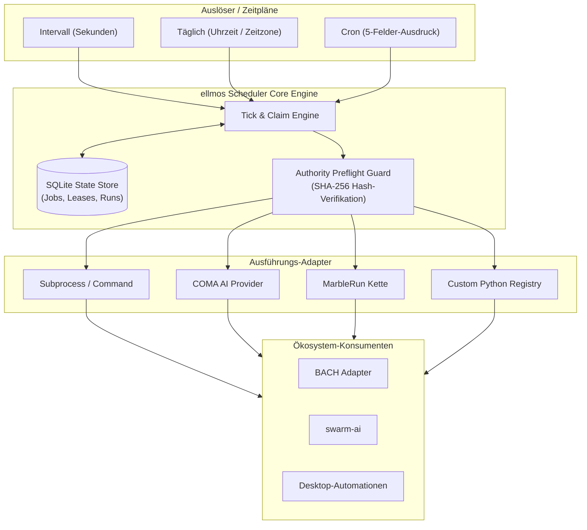
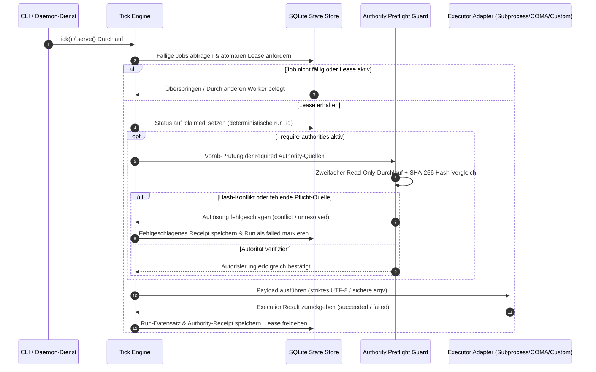

# ellmos Scheduler


[](https://github.com/ellmos-ai/ellmos-scheduler)
[](https://github.com/ellmos-ai/ellmos-scheduler/actions)
[](https://python.org)
[](https://github.com/ellmos-ai/ellmos-scheduler)
[](LICENSE)
[](tests/)
[](https://github.com/astral-sh/ruff)
[](SECURITY.md)
[](SECURITY.md)
[](THIRD_PARTY_LICENSES.md)
[](MARKETING-LOG.txt)
[](https://github.com/ellmos-ai)
[](https://github.com/open-bricks)
[](llms.txt)

[English](README.md) | [Deutsch](README_de.md)

## Schnellnavigation

- [Übersicht](#ellmos-scheduler)
- [Architektur & Systemübersicht](#architektur--systemübersicht)
- [Ausführungs- & Authority-Preflight-Lebenszyklus](#ausführungs--authority-preflight-lebenszyklus)
- [Governance & Laufzeit-Invarianten](#governance--laufzeit-invarianten)
- [Zuständigkeitsgrenzen](#verantwortungsgrenze)
- [Unterstützte Zeitpläne](#unterstützte-zeitpläne)
- [Schnellstart](#schnellstart)
- [Kanonische Autoritäten pro Lauf](#kanonische-autoritäten-pro-lauf)
- [Sicherheits- und Verfügbarkeitsmodell](#sicherheits--und-verfügbarkeitsmodell)
- [Migration von BACH](#migration-von-bach)
- [Bundles und Partner](#bundles-und-partner)
- [Ökosystem & Geschwister-Werkzeuge](#ökosystem--geschwister-werkzeuge)
- [Drittanbieter-Lizenzen & Transparenz](#drittanbieter-lizenzen--transparenz)
- [Marketing & Zielgruppen](#marketing--zielgruppen)
- [Vergleichsmatrix gegenüber Alternativen](#vergleichsmatrix-gegenüber-alternativen)
- [Entwicklung, Sicherheit & Lizenz](#entwicklung-sicherheit--lizenz)

> [!NOTE]
> **Für KI-Agenten & LLM-Tools:** Dieses Repository bietet einen maschinenlesbaren Index unter [`llms.txt`](llms.txt) für automatisierte Exploration, Funktionsübersichten und CLI-Schnittstellen.

Eigenständiger Zeitgeber und Run-Recorder für modulare ellmos-Stacks. Das Modul
ist bewusst **außerhalb von BACH** angelegt. BACH, Wonderland/Riverfall,
Desktop-Automationen, COMA, MarbleRun/llmauto und swarm-ai können es über
schmale Adapter konsumieren.

Status: `0.3.5` (Pfad B Discoverability, 16-Punkte zweisprachige Schnellnavigations-Parität, 10-Dimensionen-Vergleichsmatrix gegenüber 4 Alternativen, SEO-Suchbegriffe, Drittanbieter-Lizenzaudit und Vertragstestsuite, 2026-09-14).

Auf Windows installiert das Paket `tzdata` als bedingte Runtime-Abhängigkeit.
Damit funktionieren IANA-Zeitzonen wie `Europe/Berlin` auch in einem sauberen
virtuellen Environment, in dem das Betriebssystem keine Zoneinfo-Daten für
Python bereitstellt.

## Architektur & Systemübersicht



### Ausführungs- & Authority-Preflight-Lebenszyklus



## Governance & Laufzeit-Invarianten

`ellmos-scheduler` erfüllt 10 verbindliche System- und Betriebsinvarianten, um eine deterministische, sichere und auditierbare Aufgabenplanung im lokalen Multi-Agenten-Ökosystem zu garantieren:

| Invariante | Bereich | Garantie & Verifikation |
|---|---|---|
| `INV-LOCAL-01` **1. 100% Local-First & Zero-Egress** | Systemarchitektur | Arbeitet vollständig offline auf dem lokalen System; garantiert keine externen Telemetrie- oder Netzwerkanfragen. |
| `INV-PRIV-02` **2. Unprivilegierter User-Mode Betrieb** | Sicherheitsgrenze | Vollständig im unprivilegierten Anwendermodus ausführbar, erfordert keinerlei Administrator- oder Root-Rechte (`RunAsInvoker`). |
| `INV-CONC-03` **3. Atomare SQLite-Leases & Deduplizierung** | Nebenläufigkeitskontrolle | Deterministische `run_id` und atomare SQLite-Transaktionen verhindern doppelte Ausführung paralleler Worker zuverlässig. |
| `INV-AUTH-04` **4. Zweifache Read-Only Authority-Prüfung** | Integritätsschutz | Verbindliche Autorisierungsdateien werden vor Start zweifach schreibgeschützt gelesen und per SHA-256-Prüfsumme validiert. |
| `INV-STRM-05` **5. Strikte UTF-8- & Fail-Closed Kodierung** | Datenstrom-Hygiene | Ausgabeströme werden mit strikter Fehlerbehandlung (`utf-8:strict`) dekodiert; unlesbare Daten brechen sicher ab. |
| `INV-EXEC-06` **6. Shell-freie sichere Prozessausführung** | Ausführungssicherheit | Befehle akzeptieren ausschließlich strukturierte `argv`-Listen ohne Shell-Interpolation (`shell=False`). |
| `INV-RES-07` **7. Fail-Closed Timeout & Lease-Wiederherstellung** | Prozess-Resilienz | Hängende oder abgestürzte Prozesse werden über Timeouts beendet und verwaiste Leases als `abandoned` freigegeben. |
| `INV-MOD-08` **8. Deklarative modulare Entkopplung** | Systemarchitektur | Steckbare Ausführungs-Registries und Authority-Resolver ohne Bindung an Monolithen (z. B. BACH). |
| `INV-PLAT-09` **9. Plattformübergreifende Parität** | Portabilität | Vollständige Kompatibilität auf Windows (inkl. IANA `tzdata`), Linux und macOS. |
| `INV-SLA-10` **10. Kryptographische Receipt-Persistenz** | Auditierbarkeit | Unveränderliche Belege mit SHA-256 Hashwerten und geheimnisfreien Metadaten zur lückenlosen Nachvollziehbarkeit. |

## Verantwortungsgrenze

- ellmos Scheduler: Zeitplan, Due-Ermittlung, Lease/Claim, deduplizierende
  `run_id`, Pause/Resume, Run-Historie und Heartbeat.
- COMA: Provider-Prozess starten und Ergebnis abholen.
- MarbleRun/llmauto: Ketten ausführen.
- swarm-ai: Agentenmuster ausführen.
- `.SYNC/automation-exchange`: systemübergreifender Aufgaben-,
  Abdeckungs- und Vertretungsvertrag.
- BACH: Consumer über `BachSchedulerAdapter`, nicht Eigentümer der
  Scheduler-Logik.

## Unterstützte Zeitpläne

```json
{"kind": "interval", "seconds": 3600}
{"kind": "daily", "time": "04:00", "timezone": "Europe/Berlin"}
{"kind": "cron", "expression": "*/15 * * * *", "timezone": "Europe/Berlin"}
```

Cron unterstützt fünf Felder, `*`, Listen, Bereiche und Schritte.

## Schnellstart

```powershell
python -m pip install -e ".[dev]"
ellmos-scheduler --db "$env:LOCALAPPDATA\ellmos\scheduler.db" init
ellmos-scheduler --db "$env:LOCALAPPDATA\ellmos\scheduler.db" add `
  --id sync.daily.cross-system `
  --schedule '{"kind":"daily","time":"09:00","timezone":"Europe/Berlin"}' `
  --executor command `
  --payload '{"argv":["python","C:\\path\\to\\task.py"],"cwd":"C:\\Users\\lukas"}' `
  --authorities '[{"id":"policy:sync","type":"policy","resolver":"file","required":true,"source":{"path":"C:\\authorities\\SYNC_PROTOCOL.md"}}]'
ellmos-scheduler --db "$env:LOCALAPPDATA\ellmos\scheduler.db" status --json
ellmos-scheduler --db "$env:LOCALAPPDATA\ellmos\scheduler.db" serve --require-authorities
```

Für vorbereitete Cutover- oder Shadow-Jobs materialisiert `add --disabled` den
Datensatz atomar deaktiviert. Dadurch entsteht kein Zeitfenster, in dem ein
parallel laufender Scheduler den neuen Job zwischen `add` und `disable`
beanspruchen könnte. Aktiviert wird später explizit mit `enable <job-id>`.

`command` und der gleichwertige Name `subprocess` akzeptieren ausschließlich
eine `argv`-Liste und starten ohne Shell. Zusätzlich sind `noop`, `coma` und
`marblerun` registriert:

```json
{"executor":"coma","payload":{"provider":"codex","prompt":"Prüfe den Build","cwd":"C:\\repo"}}
{"executor":"marblerun","payload":{"chain":"review-chain","background":false}}
```

Command-Ausgabe ist standardmäßig UTF-8. Python-Kinder erhalten dafür einen
expliziten `PYTHONIOENCODING`-/UTF-8-Vertrag. Ein nachweislich anders
kodierender Prozess muss `payload.output_encoding` setzen, etwa `cp1252`.
Zugelassen sind die streamtauglichen Verträge ASCII, CP437, CP850, CP1252,
Latin-1, UTF-8/UTF-8-SIG und UTF-16/UTF-16-LE/UTF-16-BE. Ein expliziter
`PYTHONIOENCODING`-Fehlerhandler muss `strict` sein.
Nicht dekodierbare Ausgabe lässt den Lauf fail-closed fehlschlagen, statt
Audit-Text still durch Ersatzzeichen zu verfälschen. JSON-CLI-Ausgabe bleibt
auch unter älteren Windows-Codepages durch ASCII-Escapes lesbar.

COMA wird erst beim tatsächlichen Lauf importiert. Der MarbleRun-Adapter startet
die öffentliche CLI als sichere argv-Liste und respektiert den
Scheduler-Timeout. Die jeweiligen Pakete müssen für diese Adapter installiert
sein. Codex-Custom-Prompts und App-Aufgaben nicht durch einen unbelegten
`codex exec /command`-Aufruf simulieren; der jeweilige native Einstieg muss
separat live verifiziert sein.

Eigene Integrationen erhalten eine isolierte Registry:

```python
from ellmos_scheduler import ExecutionResult, ExecutorRegistry, SchedulerService

registry = ExecutorRegistry()
registry.register(
    "my-adapter",
    lambda payload, timeout: ExecutionResult("succeeded", output="ok"),
)
service = SchedulerService(store, registry=registry)
```

Eine doppelte Registrierung schlägt fehl. Absichtliches Ersetzen erfordert
`replace=True`; dadurch können parallel laufende Scheduler-Instanzen getrennte
Adaptermengen verwenden.

## Kanonische Autoritäten pro Run

Jeder Job kann explizite `rule`, `policy`, `decision`, `workflow` oder
`user-preference`-Quellen (sowie weitere stabile Typen) deklarieren. Der
Scheduler liest sie unmittelbar vor dem Executor zweimal read-only, verlangt
für required Quellen einen identischen SHA-256-Readback und speichert nur
Authority-ID/-Typ, Requirement, Resolver, sichere Herkunft, Hashes, Bytezahl und
Status. Rohinhalt oder Secret-Metadaten werden abgewiesen und nicht persistiert.

```powershell
ellmos-scheduler --db C:\state\scheduler.db set-authorities sync.daily `
  --authorities '[{"id":"rule:global","type":"rule","resolver":"file","required":true,"source":{"path":"C:\\authorities\\CLAUDE.md"}},{"id":"preference:approved","type":"user-preference","resolver":"file","required":false,"source":{"path":"C:\\authorities\\USER.md"}}]'

ellmos-scheduler --db C:\state\scheduler.db tick --require-authorities --json
ellmos-scheduler --db C:\state\scheduler.db authority-receipt <run-id> --json
```

Für einen isolierten Carrier- oder Operatorlauf begrenzt wiederholbares
`--job` Claiming, Lease-Recovery, Authority-Auflösung und Ausführung auf
ausdrücklich benannte Job-IDs:

```powershell
ellmos-scheduler --db C:\state\scheduler.db tick `
  --job sync.daily --require-authorities --json
```

Nicht genannte fällige Jobs und ihre ausgelaufenen Leases bleiben unverändert.
Ohne `--job` bleibt das globale Tick-Verhalten bestehen.

Required `unresolved`/`conflict` stoppt vor der Provider-/Command-Ausführung.
Optionales Fehlen bleibt typisiert im Receipt. Der Authority-Set-Hash bleibt
bei identischer Auflösung über Runs stabil; jede einzelne `receipt_id` ist an
die konkrete `run_id` gebunden. Bestehende 0.1.x-Datenbanken werden additiv
migriert; alte Jobs laufen im kompatiblen Standardmodus mit leerem Set weiter.
`--require-authorities` ist das explizite Cutover-Gate nach abgeschlossener
Jobmigration. Eigene Resolver lassen sich über `AuthorityResolverRegistry`
injizieren, müssen aber zusammen mit einer Source-Allowlist/Validierung
registriert werden und denselben secretfreien Hash-/Readback-Vertrag erfüllen.
Die Auflösung und Receipt-Persistierung geschieht noch im Zustand `claimed`;
erst ein erfolgreicher Required-Preflight setzt `started_at` und `running`.

## Sicherheits- und Verfügbarkeitsmodell

- Fällige Läufe erhalten atomar eine deterministische `run_id`.
- Eine Lease verhindert einen zweiten Writer für dasselbe Jobfenster.
- Ein Claim gilt nicht als Erfolg; erst der abgeschlossene Run-Record zählt.
- Ausgelaufene Claims werden als `abandoned` markiert und dürfen erneut geplant
  werden.
- Globales und jobbezogenes Pause/Resume bleibt getrennt von `enabled`.
- Status liefert `last_tick_at`, Jobzahlen und Runzahlen maschinenlesbar.
- Vollständige Sicherheitsrichtlinien und Datenschutz-Invarianten sind in [`SECURITY.md`](SECURITY.md) hinterlegt.

## Migration aus BACH

Siehe [MIGRATION_FROM_BACH.md](MIGRATION_FROM_BACH.md). Der bestehende
`BACH/system/hub/scheduler.py` bleibt bis zum Betriebsvergleich als
Legacy-Quelle in Betrieb. Ein Dry-Run zeigt übertragbare und bewusst
übersprungene Jobs, ohne die Quell- oder Zieldatenbank anzulegen bzw. zu ändern:

```powershell
ellmos-scheduler --db C:\state\scheduler.db import-bach `
  --source-db C:\BACH\system\data\bach.db `
  --bach-root C:\BACH `
  --timezone Europe/Berlin `
  --dry-run --json
```

Der Python-Einstieg `create_bach_adapter(state_db)` liefert die schmale
Consumer-API, die BACH hinter seiner `scheduler_provider`-Seam verwenden kann.

## Bundles und Partner

`ellmos-scheduler` bleibt ein einzeln nutzbarer Zeitgeber. In der
V4-Komposition ist es ein erforderlicher Zeit- und Run-Recorder im
`ellmos-automation-control-bundle`; es entscheidet weiterhin nur **wann**
etwas fällig ist, nicht welcher Provider, Workflow oder Agent ausführt.

Direkte Bundlepartner sind die erforderliche Automationsregistry und
Runtime-Readback-Komponente; die Cloud-Control-Schicht ist empfohlen. Für das
Profil `self-healing` ist `automation-self-care` der erforderliche
Skillpartner: Er wird deklarativ aufgelöst und kann bezogen werden, aktiviert
oder verändert aber ohne die vorgesehenen Freigabe-, Native-Readback- und
Rollback-Gates keine Automatisierung.

Die verbindliche Mitgliedschaft, Versionen, Profile und privaten
Zusammensetzungsrezepte stehen ausschließlich im Bundle-Manifest. Diese
Übersicht ist öffentlich und dient nur der Partner-Discovery.

## Ökosystem & Geschwister-Werkzeuge

Bestandteil der [ellmos-ai](https://github.com/ellmos-ai) Multi-Agenten-Infrastruktur und des übergeordneten [open-bricks](https://github.com/open-bricks) Open-Source-Ökosystems:

| Werkzeug | Organisation | Beschreibung |
|----------|--------------|--------------|
| [ellmos-core](https://github.com/ellmos-ai/ellmos-core) | ellmos-ai | Modulare KI-Laufzeit, Aufgaben-Dispatching & Agenten-Zustandssubstrat |
| [ellmos-scheduler](https://github.com/ellmos-ai/ellmos-scheduler) | ellmos-ai | Lokaler Cron-, Intervall- & Aufgabenplanungs-Ausführungsmotor |
| [clutch](https://github.com/ellmos-ai/clutch) | ellmos-ai | Adaptiver Multi-Modell-LLM-Router & Agenten-Ausführungssteuerung |
| [coma](https://github.com/ellmos-ai/coma) | ellmos-ai | Single-Binary Multi-Agenten-Orchestrator & Ausführungskoordinator |
| [gardener](https://github.com/ellmos-ai/gardener) | ellmos-ai | Lokale autonome Sitzungs- und Kontextspeicher-Engine |
| [prompt-evidence-collector](https://github.com/ellmos-ai/prompt-evidence-collector) | ellmos-ai | Revisionssichere LLM-Interaktionserfassung & kryptographischer Nachweisspeicher |
| [lock-master](https://github.com/ellmos-ai/lock-master) | ellmos-ai | Multi-Agenten Datei- und Repository-Sperrprotokoll |
| [ticket-master](https://github.com/ellmos-ai/ticket-master) | ellmos-ai | Autonome Ticket-Routing- und Aufgaben-Dispatching-Konsole |
| [ellmos-controlcenter-mcp](https://github.com/ellmos-ai/ellmos-controlcenter-mcp) | ellmos-ai | MCP-Laufzeitaufsicht, Skill-Routing & Werkzeug-Bundle-Erkennung |
| [ellmos-filecommander-mcp](https://github.com/ellmos-ai/ellmos-filecommander-mcp) | ellmos-ai | MCP-Dateiverwaltungs-, Safe-Delete- & Archivierungs-Server |
| [ellmos-codecommander-mcp](https://github.com/ellmos-ai/ellmos-codecommander-mcp) | ellmos-ai | MCP-Codeanalyse-, AST-Transformations- & Formatierungs-Server |
| [ellmos-clatcher-mcp](https://github.com/ellmos-ai/ellmos-clatcher-mcp) | ellmos-ai | MCP-Zwischenablage- & Scratchpad-Manager mit Dry-Run-Sicherheit |
| [n8n-manager-mcp](https://github.com/ellmos-ai/n8n-manager-mcp) | ellmos-ai | MCP-n8n-Workflow-Verwaltung, Ausführungsüberwachung & Node-Introspektion |
| [skills](https://github.com/ellmos-ai/skills) | ellmos-ai | Multi-Agenten-Fähigkeitenbibliothek & Agenten-Katalog |
| [usb-podcast-studio](https://github.com/entertain-and-more/usb-podcast-studio) | entertain-and-more | Desktop-Audio-Workstation, Soundboard & Aufnahme-Suite (Klangpult) |
| [companion-for-agy](https://github.com/ellmos-ai/companion-for-agy) | ellmos-ai | Terminal-Begleiter & PTY-Wrapper für Google Antigravity |
| [safe-start-for-codex](https://github.com/dev-bricks/safe-start-for-codex) | dev-bricks | Sicherer Starter und Rechte-Isolator für Codex CLI-Sitzungen |
| [automizer-for-claude-desktop](https://github.com/dev-bricks/automizer-for-claude-desktop) | dev-bricks | Aufgabenplanungs- und Automatisierungsmanager für Claude Desktop |
| [DevCenter](https://github.com/dev-bricks/DevCenter) | dev-bricks | Entwickler-Leitstand, Repository-Dashboard & Umgebungsmanager |
| [CodeBox](https://github.com/dev-bricks/CodeBox) | dev-bricks | Polyglotte Code-Snippet-Verwaltung & Entwickler-Werkbank |
| [open-bricks](https://github.com/open-bricks) | open-bricks | Dachkatalog für Open-Source-Bausteine, Werkzeuge und Bibliotheken |

---

## Drittanbieter-Lizenzen & Transparenz

`ellmos-scheduler` verpflichtet sich zu strikten Open-Source-Standards und maximaler Transparenz:
- **100% Freie & Permissive Lizenzen**: Sämtliche Laufzeit- (`tzdata`, Python Standardbibliothek) und Entwicklungswerkzeuge (`pytest`, `tomli`, `ruff`, `setuptools`) unterliegen OSI-anerkannten permissiven Lizenzen (MIT, Apache-2.0, PSFL, Public Domain).
- **Zero-Egress-Garantie (`INV-LOCAL-01`)**: Keine Abhängigkeit überträgt Telemetrie- oder Analysedaten.
- **Unprivilegierter Modus (`INV-PRIV-02`)**: Läuft vollständig im Standard-Benutzerkontext (`RunAsInvoker`).
- Detaillierte Lizenztexte, Quellnachweise und Revisionsprüfungen sind in [`THIRD_PARTY_LICENSES.md`](THIRD_PARTY_LICENSES.md) hinterlegt.

---

## Marketing & Zielgruppen

Konzipiert für autonome Agentensysteme, deterministische Workflows und unternehmenskritische Sicherheitsanforderungen:
1. **Autonome Multi-Agenten- & Swarm-Entwickler**: Überschneidungsfreie Zeitsteuerung für Agentenschleifen, Kontext-Kompaktierung und Auswertungen via atomarer SQLite-Lease-Zuweisung.
2. **Local-First- & Zero-Egress-Entwickler**: Vollständig autarkes Scheduling ohne externe Cloud-Abhängigkeiten oder Telemetrie.
3. **DevOps- & System-Administratoren**: Einheitliche Zeitsteuerung über Windows, Linux und macOS hinweg mit nativer Windows-IANA-Zeitzonenunterstützung.
4. **Compliance-Beauftragte & Audit-Verantwortliche**: Zweifache kryptographische Preflight-Prüfung (SHA-256) und unveränderliche Ausführungsbelege.

### High-Intent Suchbegriffe & Auffindbarkeit

- **Primäre Suchintention**: `Python deterministischer lokaler Zeitplaner`, `SQLite Lease Job Scheduler`, `Zero-Egress Aufgabenplaner`, `Multi-Agenten Task Scheduler`, `lokaler Cron Dienst ohne Redis`
- **Architektur & Long-Tail**: `Offline Aufgabenplanung ohne Cloud`, `Python Zeitsteuerung ohne externe Dienste`, `Aufgabenplaner mit Revisionsnachweisen`, `sichere Subprozess Ausfuehrung ohne Shell`, `Agenten Speicher Kompaktierung Scheduler`

---

## Vergleichsmatrix gegenüber Alternativen

| Dimension / Fähigkeit | `ellmos-scheduler` | OS Cron / Windows Task Scheduler | Celery Beat / Redis Queue | APScheduler | Cloud Schedulers (AWS/GCP) |
|---|---|---|---|---|---|
| **Zero-Egress / Local-First (`INV-LOCAL-01`)** | **100% Offline & Lokal** | Lokaler OS-Dienst | Benötigt Netzwerk-Broker | In-Process Dienst | Cloud SaaS-Abhängigkeit |
| **Parallelität & Leases (`INV-CONC-03`)** | **Atomare SQLite-Leases** | Keine (Überlappung) | Verteilter Redis-Lock | In-Memory Locks | Verteilter Cloud-Lock |
| **Authority-Preflight-Gate (`INV-AUTH-04`)** | **SHA-256 Dual-Check** | Keine | Keine | Keine | IAM-Richtlinienprüfung |
| **Rechte- & Prozessmodell (`INV-PRIV-02`)** | **Unprivilegiert (RunAsInvoker)** | Oft root / SYSTEM | Benutzer oder Daemon | In-Process Thread | Cloud-IAM-Rolle |
| **Audit-Trail & Nachweise (`INV-SLA-10`)** | **Unveränderliche DB-Belege** | Syslog / Event-Log | Task-Status in Broker | Flüchtig im Speicher | CloudWatch / Cloud Audit |
| **Plattformübergreifend (`INV-PLAT-09`)** | **Voll (Win/Mac/Linux + tzdata)**| Unterschiedliche Syntax | Hoch | Hoch | N/A (Cloud-Dienst) |
| **Agenten- & Swarm-Ready (`INV-MOD-08`)** | **Nativ (COMA/MarbleRun)** | Benötigt Skripte | Generische Worker | Generische Callables | Webhooks / Lambdas |
| **Shell-Injektionsschutz (`INV-EXEC-06`)** | **Strikte argv (`shell=False`)** | Shell-String-Ausführung| Gemischt | Python Callables | Container Entrypoint |
| **Stream-Kodierungshygiene (`INV-STRM-05`)**| **Striktes UTF-8 Fail-Closed** | OS-Standard / Verlustbehaftet | Serialisierte Strings | Prozess-Stdout | Cloud-Log-Streams |
| **Fehler- & Lease-Recovery (`INV-RES-07`)** | **Auto-Abandoned-Recovery** | Deadlocks / Hänger | Worker-Heartbeat-Verlust| Keine / Speicherverlust | Dead-Letter-Queues |

Detaillierte Vergleichsmatrizen und architektonische Benchmark-Profile finden sich in [`MARKETING-LOG.txt`](MARKETING-LOG.txt).

---

## Entwicklung, Sicherheit & Lizenz

- **Sicherheitsrichtlinie & Schwachstellen**: Detaillierte Meldewege und SLAs (48h Erstbestätigung, 5 Werktage Triage) finden sich in [`SECURITY.md`](SECURITY.md).
- **Änderungsprotokoll**: Vollständige Versions- und Release-Dokumentation in [`CHANGELOG.md`](CHANGELOG.md).
- **Lizenz**: MIT Lizenz. Siehe [LICENSE](LICENSE) für Details.
