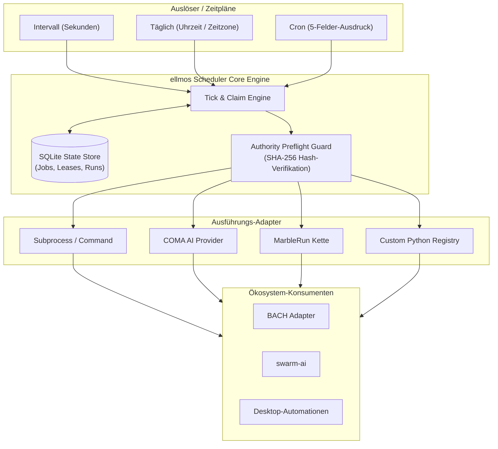
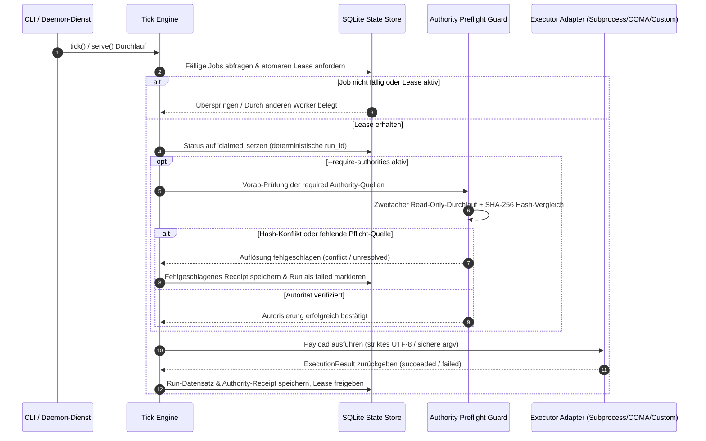

# ellmos Scheduler


[](https://github.com/ellmos-ai/ellmos-scheduler)
[](https://github.com/ellmos-ai/ellmos-scheduler/actions)
[](https://python.org)
[](https://github.com/ellmos-ai/ellmos-scheduler)
[](LICENSE)
[](NOTICE)
[](tests/)
[](https://github.com/astral-sh/ruff)
[](SECURITY.md)
[](SECURITY.md)
[](THIRD_PARTY_LICENSES.md)
[](MARKETING-LOG.txt)
[](https://github.com/ellmos-ai)
[](https://github.com/open-bricks)
[](llms.txt)
[](llms.txt)
[](SECURITY.md)

[English](README.md) | [Deutsch](README_de.md)

## Schnellnavigation

1. [Übersicht & Kernidentität](#sec-01)
2. [Zielgruppen & High-Intent SEO-Suchanfragen](#sec-02)
3. [Vergleichsmatrix gegenüber Alternativen](#sec-03)
4. [Governance & Laufzeit-Invarianten Matrix](#sec-04)
5. [Visuelle Architektur & Systemübersicht](#sec-05)
6. [Ausführungs- & Authority-Preflight-Lebenszyklus](#sec-06)
7. [Zuständigkeitsgrenzen & Architektur](#sec-07)
8. [Unterstützte Zeitpläne & Cron-Ausdrücke](#sec-08)
9. [Schnellstart & Typische Workflows](#sec-09)
10. [Kanonische Autoritäten pro Lauf](#sec-10)
11. [Sicherheits- und Verfügbarkeitsmodell](#sec-11)
12. [Migration von BACH](#sec-12)
13. [Bundles und Partner](#sec-13)
14. [Ökosystem & Geschwister-Werkzeuge](#sec-14)
15. [Maschinenlesbarer LLM-Kontext (llms.txt)](#sec-15)
16. [Testing, Verifikation & Qualitäts-Gates](#sec-16)
17. [Drittanbieter-Lizenzen & Level 1 SBOM](#sec-17)
18. [Gesetzlicher Hinweis, Haftungsbeschränkung & Lizenz (§ 521 BGB)](#sec-18)

---

<a id="sec-01"></a><a id="ellmos-scheduler"></a><a id="overview"></a>
## 1. Übersicht & Kernidentität

> [!NOTE]
> **Für KI-Agenten & LLM-Tools:** Dieses Repository bietet einen maschinenlesbaren Index unter [`llms.txt`](llms.txt) für automatisierte Exploration, Funktionsübersichten und CLI-Schnittstellen.

Eigenständiger Zeitgeber und Run-Recorder für modulare ellmos-Stacks. Das Modul
ist bewusst **außerhalb von BACH** angelegt. BACH, Wonderland/Riverfall,
Desktop-Automationen, COMA, MarbleRun/llmauto und swarm-ai können es über
schmale Adapter konsumieren.

Status: `0.3.6` (Pfad B Discoverability, 18-Punkte zweisprachige Schnellnavigations-Parität, 10-Dimensionen-Vergleichsmatrix gegenüber 4 Alternativen, SEO-Suchbegriffe, Level 1 SBOM Invariant Cross-Reference Matrix, 20-Topic Sättigung, 2026-09-26).

Auf Windows installiert das Paket `tzdata` als bedingte Runtime-Abhängigkeit.
Damit funktionieren IANA-Zeitzonen wie `Europe/Berlin` auch in einem sauberen
virtuellen Environment, in dem das Betriebssystem keine Zoneinfo-Daten für
Python bereitstellt.

---

<a id="sec-02"></a><a id="marketing--zielgruppen"></a><a id="target-personas--high-intent-seo-queries"></a>
## 2. Zielgruppen & High-Intent SEO-Suchanfragen

Konzipiert für autonome Agentensysteme, deterministische Workflows und unternehmenskritische Sicherheitsanforderungen:

### `[PERSONA-01]` Autonome Multi-Agenten- & Swarm-Entwickler
- **Profil:** Ingenieure, die verteilte Multi-Agenten-Systeme und persistente LLM-Worker-Swarms orchestrieren.
- **Problem:** Schwere Cloud-Queues (Celery, Redis) erzeugen massiven Betriebsaufwand; Standard-Cron bietet keine atomare Entduplizierung oder Worker-Lease-Garantien.
- **Lösung:** `ellmos-scheduler` bietet atomares SQLite-Lease-Claiming, inhaltsadressierte deterministische `run_id`-Erzeugung und zuverlässige Fehlerbehandlung.

### `[PERSONA-02]` Local-First- & Zero-Egress-Entwickler
- **Profil:** Entwickler, die offline-fähige Entwicklerwerkzeuge und datenschutzorientierte Automationsumgebungen schaffen.
- **Problem:** Zeitplaner, die Telemetrie übertragen oder Cloud-APIs kontaktieren, verletzen strikte Air-Gapped-Sicherheitsanforderungen.
- **Lösung:** Vollständige Zero-Egress-Garantie (`INV-LOCAL-01`), die ausschließlich auf lokalen SQLite-Datenbanken im unprivilegierten Benutzerkontext läuft.

### `[PERSONA-03]` DevOps- & System-Administratoren
- **Profil:** Systemadministratoren und SREs, die konsistente Zeitsteuerung über heterogene Entwicklerflotten hinweg verlangen.
- **Problem:** Inkompatible Syntax zwischen Linux-Cron und Windows Task Scheduler, verschärft durch fehlende IANA-Zeitzonendaten unter Windows.
- **Lösung:** Plattformübergreifend einheitliche Ausführung mit gebündeltem `tzdata`-Fallback für identische Intervall-, Tages- und Cron-Semantik auf Windows, Linux und macOS.

### `[PERSONA-04]` Compliance-Beauftragte & Audit-Verantwortliche
- **Profil:** Auditoren und Sicherheitsbeauftragte, die nachweisbare Vorab-Prüfungen vor der Ausführung verlangen.
- **Problem:** Cron-Jobs laufen blind an, ohne zu prüfen, ob Genehmigungsentscheidungen, Sicherheitsrichtlinien oder Abhängigkeitsinvarianten gültig sind.
- **Lösung:** Zweifacher Read-Only-Durchlauf + SHA-256 Authority-Preflight (`--require-authorities`) und unveränderliche kryptographische Ausführungsbelege.

### High-Intent Suchbegriffe & Auffindbarkeit
- **Primäre Suchintention:** `Python deterministischer lokaler Zeitplaner`, `SQLite Lease Job Scheduler`, `Zero-Egress Aufgabenplaner`, `Multi-Agenten Task Scheduler`, `lokaler Cron Dienst ohne Redis`.
- **Architektur & Long-Tail:** `Offline Aufgabenplanung ohne Cloud`, `Python Zeitsteuerung ohne externe Dienste`, `Aufgabenplaner mit Revisionsnachweisen`, `sichere Subprozess Ausfuehrung ohne Shell`, `Agenten Speicher Kompaktierung Scheduler`.

---

<a id="sec-03"></a><a id="vergleichsmatrix-gegenüber-alternativen"></a><a id="comparative-matrix"></a>
## 3. Vergleichsmatrix gegenüber Alternativen

Die folgende Matrix vergleicht `ellmos-scheduler` mit vier gängigen Industriealternativen über zehn kritische Architektur- und Governance-Dimensionen:

| Dimension / Fähigkeit | `ellmos-scheduler` | OS Cron / Windows Task Scheduler | Celery Beat / Redis Queue | APScheduler | Cloud Schedulers (AWS/GCP) |
|---|---|---|---|---|---|
| **Zero-Egress / Local-First (`INV-LOCAL-01`)** | **100% Offline & Lokal** | Lokaler OS-Dienst | Benötigt Netzwerk-Broker | In-Process Dienst | Cloud SaaS-Abhängigkeit |
| **Parallelität & Leases (`INV-CONC-03`)** | **Atomare SQLite-Leases** | Keine (Überlappung) | Verteilter Redis-Lock | In-Memory Locks | Verteilter Cloud-Lock |
| **Authority-Preflight-Gate (`INV-AUTH-04`)** | **SHA-256 Dual-Check** | Keine | Keine | Keine | IAM-Richtlinienprüfung |
| **Rechte- & Prozessmodell (`INV-PRIV-02`)** | **Unprivilegiert (RunAsInvoker)** | Oft root / SYSTEM | Benutzer oder Daemon | In-Process Thread | Cloud-IAM-Rolle |
| **Audit-Trail & Nachweise (`INV-SLA-10`)** | **Unveränderliche DB-Belege** | Syslog / Event-Log | Task-Status in Broker | Flüchtig im Speicher | CloudWatch / Cloud Audit |
| **Plattformübergreifend (`INV-PLAT-09`)** | **Voll (Win/Mac/Linux + tzdata)**| Unterschiedliche Syntax | Hoch | Hoch | N/A (Cloud-Dienst) |
| **Agenten- & Swarm-Ready (`INV-MOD-08`)** | **Nativ (COMA/MarbleRun)** | Benötigt Skripte | Generische Worker | Generische Callables | Webhooks / Lambdas |
| **Shell-Injektionsschutz (`INV-EXEC-06`)** | **Strikte argv (`shell=False`)** | Shell-String-Ausführung| Gemischt | Python Callables | Container Entrypoint |
| **Stream-Kodierungshygiene (`INV-STRM-05`)**| **Striktes UTF-8 Fail-Closed** | OS-Standard / Verlustbehaftet | Serialisierte Strings | Prozess-Stdout | Cloud-Log-Streams |
| **Fehler- & Lease-Recovery (`INV-RES-07`)** | **Auto-Abandoned-Recovery** | Deadlocks / Hänger | Worker-Heartbeat-Verlust| Keine / Speicherverlust | Dead-Letter-Queues |

Detaillierte Vergleichsmatrizen und architektonische Benchmark-Profile finden sich in [`MARKETING-LOG.txt`](MARKETING-LOG.txt).

---

<a id="sec-04"></a><a id="governance--laufzeit-invarianten"></a><a id="governance-invariants"></a>
## 4. Governance & Laufzeit-Invarianten Matrix

`ellmos-scheduler` erfüllt 10 verbindliche System- und Betriebsinvarianten, um eine deterministische, sichere und auditierbare Aufgabenplanung im lokalen Multi-Agenten-Ökosystem zu garantieren:

| Invariante | Bereich | Garantie & Verifikation |
|---|---|---|
| `INV-LOCAL-01` **1. 100% Local-First & Zero-Egress** | Systemarchitektur | Arbeitet vollständig offline auf dem lokalen System; garantiert keine externen Telemetrie- oder Netzwerkanfragen. |
| `INV-PRIV-02` **2. Unprivilegierter User-Mode Betrieb** | Sicherheitsgrenze | Läuft strikt im unprivilegierten Benutzerkontext (`RunAsInvoker`), benötigt niemals Administrator- oder Root-Rechte. |
| `INV-CONC-03` **3. Atomare SQLite-Leases & Deduplizierung** | Nebenläufigkeit | Deterministische `run_id`-Erzeugung und atomare Datenbank-Leases verhindern Doppelstarts bei parallelen Workern. |
| `INV-AUTH-04` **4. Zweifache Read-Only Authority-Prüfung** | Integritätsschutz | Vorgeschriebene Authority-Dateien werden zweifach eingelesen und vor der Ausführung via SHA-256 kryptographisch validiert. |
| `INV-STRM-05` **5. Strikte UTF-8- & Fail-Closed Kodierung** | Datenstrom-Hygiene | Subprozess-Ausgaben erzwingen strikte Fehlerbehandlung (`utf-8:strict`), fehlerhafte Kodierungen brechen den Lauf sauber ab. |
| `INV-EXEC-06` **6. Shell-freie sichere Prozessausführung** | Prozesssicherheit | Befehlsausführungen akzeptieren ausschließlich explizite `argv`-Listen und vermeiden Shell-Interpolationen (`shell=False`). |
| `INV-RES-07` **7. Fail-Closed Timeout & Lease-Wiederherstellung** | Ausfallsicherheit | Abgelaufene oder verwaiste Worker-Leases werden als `abandoned` markiert und ohne Deadlocks sauber wieder freigegeben. |
| `INV-MOD-08` **8. Deklarative modulare Entkopplung** | Modulare Architektur | Steckbare Executor-Registry, externe Authority-Resolver und saubere Trennung außerhalb monolithischer Blöcke (z. B. BACH). |
| `INV-PLAT-09` **9. Plattformübergreifende Parität** | Portabilität | Vollständige Verhaltensparität auf Windows (mit `tzdata`-Fallback für IANA-Zonen), Linux und macOS. |
| `INV-SLA-10` **10. Kryptographische Receipt-Persistenz** | Revisionssicherheit | Lückenlose Audit-Logs mit unveränderlichen Belegen, SHA-256-Hashes und geheimnisfreien Metadaten. |

---

<a id="sec-05"></a><a id="architektur--systemübersicht"></a><a id="system-architecture"></a>
## 5. Visuelle Architektur & Systemübersicht



---

<a id="sec-06"></a><a id="ausführungs--authority-preflight-lebenszyklus"></a><a id="lifecycle"></a>
## 6. Ausführungs- & Authority-Preflight-Lebenszyklus



---

<a id="sec-07"></a><a id="verantwortungsgrenze"></a><a id="integration-boundary"></a>
## 7. Zuständigkeitsgrenzen & Architektur

- ellmos Scheduler: Zeitplan, Fälligkeitsberechnung, Lease/Claim, entduplizierende
  `run_id`, Pause/Resume, Run-Historie und Heartbeat.
- COMA: startet Provider-Prozesse und nimmt Ergebnisse entgegen.
- MarbleRun/llmauto: führt Ketten aus.
- swarm-ai: führt Agenten-Muster aus.
- `.SYNC/automation-exchange`: systemübergreifender Vertrag für Jobs, Coverage
  und Repräsentanz.
- BACH: Konsument über `BachSchedulerAdapter`, nicht Eigentümer der Scheduler-Logik.

---

<a id="sec-08"></a><a id="unterstützte-zeitpläne"></a><a id="cron-expressions"></a>
## 8. Unterstützte Zeitpläne & Cron-Ausdrücke

```json
{"kind": "interval", "seconds": 3600}
{"kind": "daily", "time": "04:00", "timezone": "Europe/Berlin"}
{"kind": "cron", "expression": "*/15 * * * *", "timezone": "Europe/Berlin"}
```

Cron unterstützt fünf Felder, `*`, Listen, Bereiche und Schrittweiten (Steps).

---

<a id="sec-09"></a><a id="schnellstart"></a><a id="cli-reference"></a>
## 9. Schnellstart & Typische Workflows

```powershell
python -m pip install -e ".[dev]"
ellmos-scheduler --db "$env:LOCALAPPDATA\ellmos\scheduler.db" init
ellmos-scheduler --db "$env:LOCALAPPDATA\ellmos\scheduler.db" add `
  --id sync.daily.cross-system `
  --schedule '{"kind":"daily","time":"09:00","timezone":"Europe/Berlin"}' `
  --executor command `
  --payload '{"argv":["python","C:\\path\\to\\task.py"],"cwd":"C:\\Users\\lukas"}' `
  --authorities '[{"id":"policy:sync","type":"policy","resolver":"file","required":true,"source":{"path":"C:\\authorities\\SYNC_PROTOCOL.md"}}]'
ellmos-scheduler --db "$env:LOCALAPPDATA\ellmos\scheduler.db" status --json
ellmos-scheduler --db "$env:LOCALAPPDATA\ellmos\scheduler.db" serve --require-authorities
```

Für vorbereitete Cutover- oder Schattenjobs materialisiert `add --disabled` den
Datensatz atomar im deaktivierten Zustand. Das verhindert, dass ein paralleler
Scheduler den Job im Intervall zwischen `add` und `disable` anstößt. Später
explizit aktivieren mit `enable <job-id>`.

`command` und `subprocess` akzeptieren ausschließlich eine `argv`-Liste und starten
ohne Shell. `noop`, `coma` und `marblerun` sind standardmäßig registriert:

```json
{"executor":"coma","payload":{"provider":"codex","prompt":"Check the build","cwd":"C:\\repo"}}
{"executor":"marblerun","payload":{"chain":"review-chain","background":false}}
```

Die Befehlsausgabe erfolgt standardmäßig in UTF-8. Python-Kindprozesse erhalten
einen expliziten `PYTHONIOENCODING`/UTF-8-Vertrag. Ein nachweislich anders
kodierter Prozess muss `payload.output_encoding` setzen, beispielsweise `cp1252`.
Erlaubte stream-sichere Verträge sind ASCII, CP437, CP850, CP1252, Latin-1,
UTF-8/UTF-8-SIG und UTF-16/UTF-16-LE/UTF-16-BE. Ein expliziter
`PYTHONIOENCODING`-Fehlerbehandler muss `strict` sein. Nicht dekodierbare Ausgabe
lässt den Lauf sauber fehlschlagen, anstatt Protokolle stillschweigend mit
Ersatzzeichen zu beschädigen. JSON-CLI-Ausgaben bleiben durch ASCII-Escapes auch
unter älteren Windows-Codepages lesbar.

COMA wird erst importiert, wenn tatsächlich ein Lauf stattfindet. Der
MarbleRun-Adapter startet die öffentliche CLI als sichere `argv`-Liste und beachtet
das Scheduler-Timeout. Die jeweiligen Pakete müssen für diese Adapter installiert
sein. Bitte simulieren Sie Codex-Custom-Prompts und App-Tasks nicht über einen
ungeprüften `codex exec /command`-Aufruf; der jeweilige native Einstiegspunkt
muss separat live verifiziert sein.

Eigene Integrationen erhalten eine isolierte Registry:

```python
from ellmos_scheduler import ExecutionResult, ExecutorRegistry, SchedulerService

registry = ExecutorRegistry()
registry.register(
    "my-adapter",
    lambda payload, timeout: ExecutionResult("succeeded", output="ok"),
)
service = SchedulerService(store, registry=registry)
```

Doppelte Registrierungen schlagen fehl. Gezieltes Ersetzen erfordert `replace=True`;
dies erlaubt parallel laufenden Scheduler-Instanzen die Nutzung getrennter Adapter-Sets.

---

<a id="sec-10"></a><a id="kanonische-autoritäten-pro-lauf"></a><a id="authorities"></a>
## 10. Kanonische Autoritäten pro Lauf

Jeder Job kann explizite `rule`-, `policy`-, `decision`-, `workflow`- oder
`user-preference`-Quellen (sowie weitere stabile Typen) deklarieren. Unmittelbar
vor der Ausführung liest der Scheduler diese zweimal schreibgeschützt ein, verlangt
für Pflichtquellen einen identischen SHA-256-Rücklesewert und speichert nur
Authority-ID/-Typ, Pflichtstatus, Resolver, sicheren Ursprung, Hashes, Byte-Zahl
und Status. Rohe Inhalte oder geheime Metadaten werden strikt abgewiesen und nie
gespeichert.

```powershell
ellmos-scheduler --db C:\state\scheduler.db set-authorities sync.daily `
  --authorities '[{"id":"rule:global","type":"rule","resolver":"file","required":true,"source":{"path":"C:\\authorities\\CLAUDE.md"}},{"id":"preference:approved","type":"user-preference","resolver":"file","required":false,"source":{"path":"C:\\authorities\\USER.md"}}]'

ellmos-scheduler --db C:\state\scheduler.db tick --require-authorities --json
ellmos-scheduler --db C:\state\scheduler.db authority-receipt <run-id> --json
```

Für einen isolierten Träger- oder Betreiberlauf wiederholen Sie `--job`, um das
Claiming, die Lease-Wiederherstellung, die Autorisierungsprüfung und die Ausführung
auf explizite Job-IDs zu beschränken:

```powershell
ellmos-scheduler --db C:\state\scheduler.db tick `
  --job sync.daily --require-authorities --json
```

Nicht aufgeführte fällige Jobs und deren abgelaufene Leases bleiben unberührt. Das
Weglassen von `--job` erhält das globale Tick-Verhalten.

Pflichtstatus `unresolved`/`conflict` stoppt vor der Provider-/Befehlsausführung.
Optionales Fehlen bleibt im Beleg typisiert vermerkt. Der Authority-Set-Hash bleibt
über Läufe mit identischer Auflösung hinweg stabil; jede `receipt_id` ist an ihre
konkrete `run_id` gebunden. Bestehende 0.1.x-Datenbanken werden additiv migriert;
alte Jobs laufen im kompatiblen Standardmodus mit leerem Set weiter.
`--require-authorities` ist das explizite Cutover-Gate nach vollendeter Job-Migration.
Eigene Resolver können über `AuthorityResolverRegistry` injiziert werden, müssen aber
zusammen mit Quellenprüfung/-Allowlisting registriert werden und denselben
geheimnisfreien Hash-/Readback-Vertrag erfüllen. Auflösung und Belegspeicherung
erfolgen, während der Zustand noch `claimed` ist; erst ein erfolgreicher
Pflicht-Preflight setzt `started_at` und `running`.

---

<a id="sec-11"></a><a id="sicherheits--und-verfügbarkeitsmodell"></a><a id="availability-model"></a>
## 11. Sicherheits- und Verfügbarkeitsmodell

- Fällige Läufe erhalten eine atomare, deterministische `run_id`.
- Ein Lease verhindert einen zweiten Schreiber für dasselbe Zeitfenster.
- Ein Claim ist kein Erfolg; nur der abgeschlossene Run-Datensatz zählt.
- Abgelaufene Claims werden als `abandoned` markiert und dürfen neu geplant werden.
- Globales und job-spezifisches Pausieren/Fortsetzen bleiben getrennt von `enabled`.
- Status liefert `last_tick_at`, Job- und Run-Zähler in maschinenlesbarer Form zurück.
- Vollständige Sicherheitsrichtlinien und Schutzgrenzen sind in [`SECURITY.md`](SECURITY.md) dokumentiert.

---

<a id="sec-12"></a><a id="migration-von-bach"></a><a id="bach-migration"></a>
## 12. Migration von BACH

Siehe [MIGRATION_FROM_BACH.md](MIGRATION_FROM_BACH.md). Das bestehende
`BACH/system/hub/scheduler.py` bleibt als Legacy-Quelle in Betrieb, bis der
Betriebsvergleich abgeschlossen ist. Ein Probelauf zeigt übertragbare und
bewusst übersprungene Jobs an, ohne die Quell- oder Zieldatenbank anzulegen
oder zu verändern:

```powershell
ellmos-scheduler --db C:\state\scheduler.db import-bach `
  --source-db C:\BACH\system\data\bach.db `
  --bach-root C:\BACH `
  --timezone Europe/Berlin `
  --dry-run --json
```

Der Python-Einstiegspunkt `create_bach_adapter(state_db)` stellt die schmale
Konsumenten-API bereit, die BACH hinter seiner `scheduler_provider`-Schnittstelle
nutzen kann.

---

<a id="sec-13"></a><a id="bundles-und-partner"></a><a id="bundles"></a>
## 13. Bundles und Partner

`ellmos-scheduler` bleibt eine separat nutzbare Uhr. In der V4-Komposition ist
sie ein Pflichtzeitgeber und Run-Recorder im `ellmos-automation-control-bundle`;
sie entscheidet weiterhin nur **wann** etwas fällig ist, nicht welcher Provider,
Workflow oder Agent es ausführt.

Direkte Bundle-Partner sind die verpflichtende Automations-Registry und die
Laufzeit-Rücklesekomponente; die Cloud-Control-Schicht wird empfohlen. Für das
Profil `self-healing` ist `automation-self-care` der erforderliche Skill-Partner:
er wird deklarativ aufgelöst und kann bezogen werden, darf eine Automation jedoch
nicht ohne die vorgeschriebenen Genehmigungs-, Native-Readback- und Rollback-Gates
aktivieren oder verändern.

Verbindliche Mitgliedschaften, Versionen, Profile und private Kompositionsrezepte
befinden sich ausschließlich im Bundle-Manifest. Diese öffentliche Übersicht dient
nur der Partnererkennung.

---

<a id="sec-14"></a><a id="ökosystem--geschwister-werkzeuge"></a><a id="sibling-tools"></a>
## 14. Ökosystem & Geschwister-Werkzeuge

Teil der [ellmos-ai](https://github.com/ellmos-ai) Multi-Agenten-Infrastruktur und des übergeordneten [open-bricks](https://github.com/open-bricks) Open-Source-Software-Ökosystems:

| Werkzeug | Organisation | Beschreibung |
|---|---|---|
| [ellmos-core](https://github.com/ellmos-ai/ellmos-core) | ellmos-ai | Modulare KI-Laufzeit, Aufgabenverteilung & Agenten-Zustandssubstrat |
| [ellmos-scheduler](https://github.com/ellmos-ai/ellmos-scheduler) | ellmos-ai | Lokaler Zeitplaner für Cron-, Intervall- & wiederkehrende Aufgaben |
| [clutch](https://github.com/ellmos-ai/clutch) | ellmos-ai | Adaptiver Multi-Modell LLM-Router & Agenten-Ausführungssteuerung |
| [coma](https://github.com/ellmos-ai/coma) | ellmos-ai | Multi-Agenten-Orchestrator & Ausführungskoordinator |
| [gardener](https://github.com/ellmos-ai/gardener) | ellmos-ai | Local-First Sitzungs- & Kontextgedächtnis für autonome Agenten |
| [prompt-evidence-collector](https://github.com/ellmos-ai/prompt-evidence-collector) | ellmos-ai | Revisionssichere Erfassung & kryptographische Beweissicherung von LLM-Läufen |
| [lock-master](https://github.com/ellmos-ai/lock-master) | ellmos-ai | Multi-Agenten Dateisperren & Concurrency-Protokoll |
| [ticket-master](https://github.com/ellmos-ai/ticket-master) | ellmos-ai | Autonome Ticket-Triage & aufgabenbezogene Agenten-Übergaben |
| [ellmos-controlcenter-mcp](https://github.com/ellmos-ai/ellmos-controlcenter-mcp) | ellmos-ai | MCP-Laufzeitüberwachung, Skill-Routing & Tool-Bundle-Discovery |
| [ellmos-filecommander-mcp](https://github.com/ellmos-ai/ellmos-filecommander-mcp) | ellmos-ai | MCP-Server für sichere Dateiverwaltung & Archivoperationen |
| [ellmos-codecommander-mcp](https://github.com/ellmos-ai/ellmos-codecommander-mcp) | ellmos-ai | MCP-Server für Code-Analyse, AST-Transformationen & Formatierung |
| [ellmos-clatcher-mcp](https://github.com/ellmos-ai/ellmos-clatcher-mcp) | ellmos-ai | MCP-Zwischenablage & Scratchpad-Manager mit Dry-Run-Schutz |
| [n8n-manager-mcp](https://github.com/ellmos-ai/n8n-manager-mcp) | ellmos-ai | MCP-Server für n8n-Workflow-Management & Node-Introspektion |
| [skills](https://github.com/ellmos-ai/skills) | ellmos-ai | Multi-Agenten Fähigkeitsbibliothek & Werkzeug-Katalog |
| [usb-podcast-studio](https://github.com/entertain-and-more/usb-podcast-studio) | entertain-and-more | Desktop-Audio-Workstation, Soundboard & Recording-Suite (Klangpult) |
| [companion-for-agy](https://github.com/ellmos-ai/companion-for-agy) | ellmos-ai | Terminal-Begleiter & PTY-Wrapper für Google Antigravity |
| [safe-start-for-codex](https://github.com/dev-bricks/safe-start-for-codex) | dev-bricks | Sicherer Starter & Rechte-Isolator für Codex CLI-Sitzungen |
| [automizer-for-claude-desktop](https://github.com/dev-bricks/automizer-for-claude-desktop) | dev-bricks | Aufgabenautomations-Manager für Claude Desktop |
| [DevCenter](https://github.com/dev-bricks/DevCenter) | dev-bricks | Entwickler-Leitstand, Repository-Dashboard & Umgebungskontrolle |
| [CodeBox](https://github.com/dev-bricks/CodeBox) | dev-bricks | Polyglotter Code-Snippet-Manager & Entwickler-Werkbank |
| [open-bricks](https://github.com/open-bricks) | open-bricks | Dachkatalog für Open-Source-Bausteine, Werkzeuge und Bibliotheken |

---

<a id="sec-15"></a><a id="machine-readable-llm-context"></a><a id="llms-txt"></a>
## 15. Maschinenlesbarer LLM-Kontext (llms.txt)

Dieses Repository stellt eine standardisierte [`llms.txt`](llms.txt)-Indexdatei im Wurzelverzeichnis bereit. Automatisierte Agenten, LLM-Toolchains und RAG-Pipelines können diesen Index nutzen, um CLI-Syntax, architektonische Randbedingungen und Schutzgrenzen strukturiert zu erfassen.

---

<a id="sec-16"></a><a id="testing-verification--quality-gates"></a><a id="testing"></a>
## 16. Testing, Verifikation & Qualitäts-Gates

Die Testsuite validiert funktionale Planungsverhalten sowie architektonische Vertragsspezifikationen:

```bash
# Vollständige Testsuite ausführen
pytest

# Strenge Code-Formatierung und Linting erzwingen
ruff check .

# Bytecode-Kompilierung validieren
python -m compileall -q src tests

# Git-Whitespace-Hygiene prüfen
git diff --check
```

---

<a id="sec-17"></a><a id="drittanbieter-lizenzen--transparenz"></a><a id="third-party-licenses"></a>
## 17. Drittanbieter-Lizenzen & Level 1 SBOM

`ellmos-scheduler` verpflichtet sich zu strikten Open-Source-Standards und maximaler Transparenz:
- **100% Freie & Permissive Lizenzen**: Sämtliche Laufzeit- (`tzdata`, Python Standardbibliothek) und Entwicklungswerkzeuge (`pytest`, `tomli`, `ruff`, `setuptools`) unterliegen OSI-anerkannten permissiven Lizenzen (MIT, Apache-2.0, PSFL, Public Domain).
- **Zero-Copyleft-Isolationsgarantie**: 0% Copyleft-Kontamination über alle Abhängigkeiten hinweg.
- **Zero-Egress-Garantie (`INV-LOCAL-01`)**: Keine Abhängigkeit überträgt Telemetrie- oder Analysedaten.
- **Unprivilegierter Modus (`INV-PRIV-02`)**: Läuft vollständig im Standard-Benutzerkontext (`RunAsInvoker`).
- Detaillierte Lizenztexte, Quellnachweise und Revisionsprüfungen sind in [`THIRD_PARTY_LICENSES.md`](THIRD_PARTY_LICENSES.md) hinterlegt.

---

<a id="sec-18"></a><a id="entwicklung-sicherheit--lizenz"></a><a id="statutory-notice--license"></a>
## 18. Gesetzlicher Hinweis, Haftungsbeschränkung & Lizenz (§ 521 BGB)

### Open-Source-Lizenz
Diese Software ist unter den Bedingungen der [MIT Lizenz](LICENSE) lizenziert.
Kanonische Urheber- und Ökosystem-Zuordnungen sind in [`NOTICE`](NOTICE) deklariert.
Detaillierte Level 1 SBOM- und Transparenznachweise befinden sich in [`THIRD_PARTY_LICENSES.md`](THIRD_PARTY_LICENSES.md).

### Gesetzlicher Hinweis & Haftungsbeschränkung (§ 521 BGB Gefälligkeitsrecht)
Die Bereitstellung dieser Software sowie der dazugehörigen Dokumentation erfolgt unentgeltlich (Gefälligkeitsverhältnis). Gemäß dem gesetzlichen Haftungsregime des deutschen Bürgerlichen Gesetzbuches (**§ 521 BGB** — *Haftung des Schenkers*) ist die Haftung für Sach- und Rechtsmängel ausdrücklich auf **Vorsatz** und **grobe Fahrlässigkeit** beschränkt. Eine Haftung für einfache oder leichte Fahrlässigkeit ist im gesetzlich zulässigen Rahmen vollständig ausgeschlossen.

### Sicherheitsrichtlinie & Reaktions-SLA
Wir verpflichten uns, den Eingang von Sicherheitsmeldungen innerhalb von **48 Stunden** zu bestätigen und innerhalb von **5 Werktagen** eine fundierte erste Triage-Bewertung über `security@open-bricks.org` und `security@ellmos.ai` bereitzustellen. Siehe [`SECURITY.md`](SECURITY.md) für vollständige Details.
